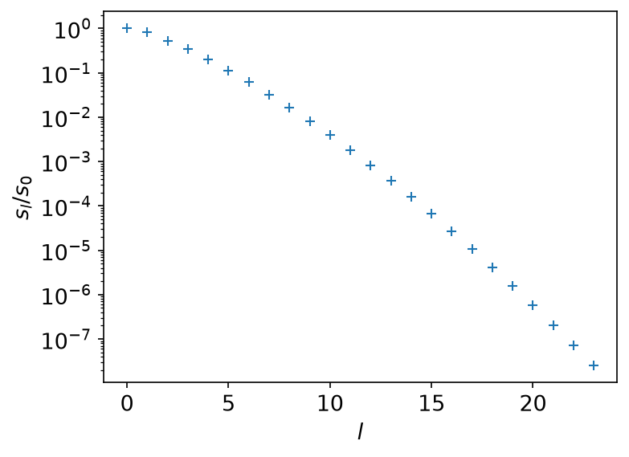
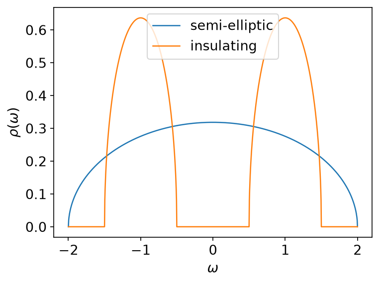
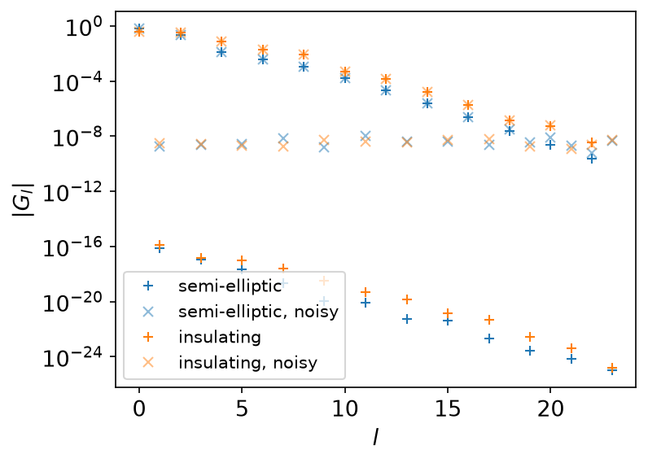
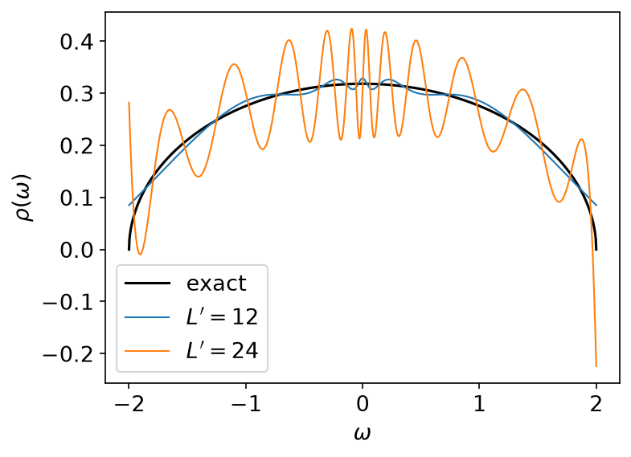
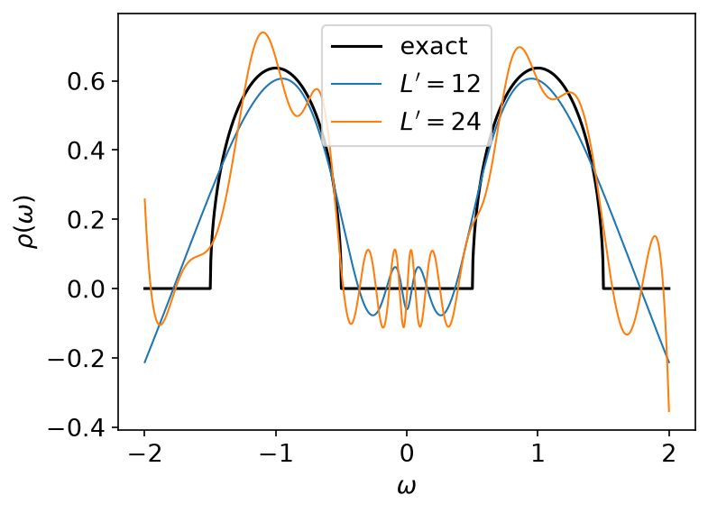
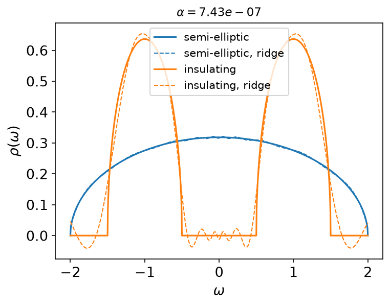
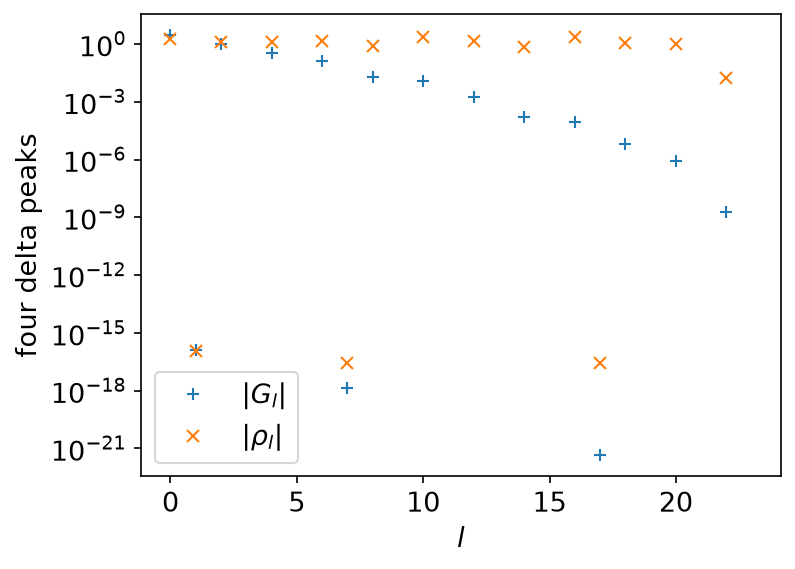
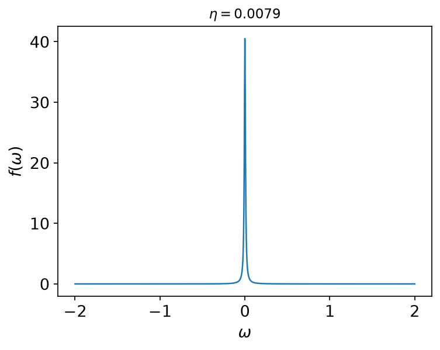
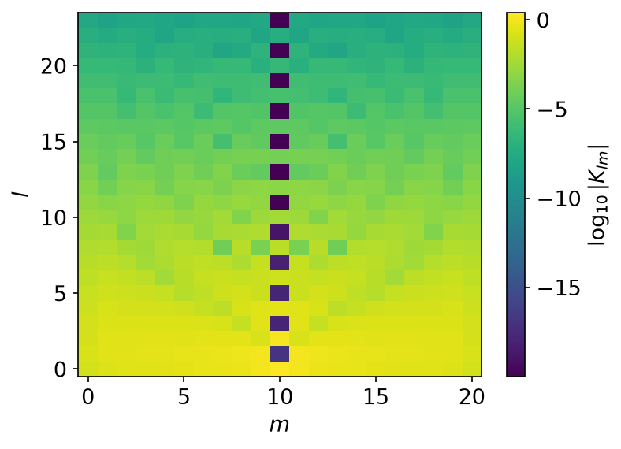

# Analytic continuation

*Ported from the Python notebook `analytic_continuation_py.ipynb` of
sparse-ir-tutorial. The program that produced every number and figure on this
page is `docs/tutorial-code/src/bin/analytic_continuation.rs`.*

Everything else in this book goes in the easy direction: from a spectral
function to a Green's function. This page goes the other way, and it is worth
a page of its own because it is the one direction that does not work.

## The problem

\\[
    G(\tau) = -\int \mathrm{d}\omega\, K(\tau, \omega)\, \rho(\omega)
\\]

In the basis this reads \\(G_l = -s_l \rho_l\\), one number at a time, and it
inverts in one line:

\\[
    \rho(\omega) = -\sum_l \frac{G_l}{s_l} v_l(\omega).
\\]

Every \\(s_l\\) is strictly positive, so the inverse exists. It is also
useless, because the \\(s_l\\) fall off exponentially:

```rust
use sparse_ir::{Fermionic, FiniteTempBasis, LogisticKernel};

let beta = 40.0;
let wmax = 2.0;
let kernel = LogisticKernel::new(beta * wmax)?;
let basis = FiniteTempBasis::<LogisticKernel, Fermionic>::new(kernel, beta, Some(2e-8), None)?;

let s = basis.s().to_vec();
assert_eq!(s.len(), 24);
assert!(s[23] / s[0] < 3e-8);
# Ok::<(), sparse_ir::Error>(())
```



At \\(\beta = 40\\), \\(\omega_\mathrm{max} = 2\\) and
\\(\varepsilon = 2 \times 10^{-8}\\) the basis has 24 functions and
\\(s_{23}/s_0 \approx 2.5 \times 10^{-8}\\). Dividing by that last singular
value multiplies whatever error rides on \\(G_{23}\\) by forty million. There
is no algorithm that avoids this: the information about the fine structure of
\\(\rho\\) is not in \\(G\\) to be recovered. All a method can do is choose
what to put in its place.

## Two models

Both are sums of normalised semicircles, so their exact \\(\rho_l\\) can be
computed to machine precision and used as ground truth. One fills the band;
the other is the same band split by a gap.



```rust,ignore
let rho_semi = shifted_semicircle_overlaps(&basis, 0.0, WMAX, 1.0);
let rho_insul = {
    let right = shifted_semicircle_overlaps(&basis, WMAX / 2.0, WMAX / 4.0, 0.5);
    let left = shifted_semicircle_overlaps(&basis, -WMAX / 2.0, WMAX / 4.0, 0.5);
    right.iter().zip(&left).map(|(a, b)| a + b).collect::<Vec<_>>()
};
let g_l: Vec<f64> = s.iter().zip(&rho_semi).map(|(sl, rho)| -sl * rho).collect();
```

Then noise is added to \\(G_l\\), at \\(0.3\,(s_{L-1}/s_0)\\) of
\\(\lVert G \rVert\\) — deliberately of the same size as the smallest
coefficient the basis still resolves.



The noise is far below every coefficient that matters and level with the ones
at the end. It is committed in `input/analytic_continuation/noise.csv` rather
than drawn, so the Rust and Python results are comparable number by number;
see that file's header for where the draws came from.

## Truncated SVD

The first regulariser is the blunt one: keep \\(\rho_l = -G_l/s_l\\) for
\\(l < L'\\) and throw the rest away.



\\(L' = 12\\) gets the shape right. \\(L' = 24\\) — using everything the basis
has — turns the answer into ringing of amplitude 0.2 around a function whose
peak is 0.32. Using *more* of the data made the answer worse, which is the
whole difficulty in one picture.

The insulating model says the same thing with a sharper edge:



## Ridge regression

The second regulariser is smooth: minimise
\\(\lVert G - (-s\rho) \rVert^2 + \alpha^2 \lVert \rho \rVert^2\\). Because
the problem is diagonal in the basis, the solution is diagonal too,

\\[
    \rho_l = -\frac{s_l}{s_l^2 + \alpha^2}\, G_l,
\\]

which passes the large singular values through unchanged and rolls the small
ones off instead of dividing by them.

```rust,ignore
let rho_l: Vec<f64> = s
    .iter()
    .zip(&g_l_noisy)
    .map(|(sl, g)| -sl / (sl * sl + alpha * alpha) * g)
    .collect();
```



With \\(\alpha = 100 \times \text{noise}\\) both models come back recognisably.
Note what is left over: the reconstruction goes negative inside the gap. A
density of states cannot do that, and no amount of tuning \\(\alpha\\) will
stop it, because nothing in the method knows that \\(\rho \geq 0\\).

## Why ρ<sub>l</sub> is the wrong unknown

It is tempting to conclude that the fix is a better penalty on \\(\rho_l\\).
It is not, and the reason is worth stating plainly: \\(G_l\\) is compact,
\\(\rho_l\\) is not. The basis is small because \\(s_l\\) makes it small — and
\\(s_l\\) belongs to \\(G\\), not to \\(\rho\\).

Take four delta peaks, \\(\rho(\omega) = \sum_i \delta(\omega - \omega_i)\\),
so that \\(\rho_l = \sum_i v_l(\omega_i)\\):



\\(G_l\\) falls off the way it always does. \\(\rho_l\\) does not fall off at
all — it is still of order one at \\(l = 23\\), and would be at \\(l = 200\\).
Truncating it at \\(L'\\) is not an approximation of anything; a penalty on
\\(\sum_l |\rho_l|^2\\) is a penalty on coefficients that were never going to
become small.

## A real-axis basis instead

So expand \\(\rho\\) on the real axis rather than in the IR basis:

\\[
    \rho(\omega) = \sum_{m} a_m\, f(\omega - \omega_m),
    \qquad
    f(\omega) = \frac{1}{\pi}\frac{\eta}{\omega^2 + \eta^2}.
\\]



\\(f\\) is a probability density, so \\(a_m \geq 0\\) gives \\(\rho \geq 0\\)
and \\(\sum_m a_m = 1\\) gives the sum rule — both of them constraints a
solver can impose exactly, neither of them expressible in the IR coefficients.
The width \\(\eta\\) is what is left to choose; \\(\eta = 0.1\,\pi/\beta\\) is
narrow enough to resolve structure on the scale of the temperature and wide
enough not to be a set of delta functions.

The data then enter through

\\[
    G_l = \sum_m K_{lm} a_m,
    \qquad
    K_{lm} = -s_l \int \mathrm{d}\omega\, v_l(\omega) f(\omega - \omega_m),
\\]

which is an ordinary constrained least-squares problem in \\(a\\).



Computing \\(K_{lm}\\) is the one place this example does real numerical work.
\\(\eta\\) is about a hundredth of the spacing between the basis' knots, so
quadrature on the knots steps straight over the peak of \\(f\\). The
substitution \\(\omega = \omega_m + \eta \tan t\\) turns
\\(f(\omega - \omega_m)\,\mathrm{d}\omega\\) into \\(\mathrm{d}t/\pi\\) and
spreads the peak across the whole interval, leaving a polynomial to integrate:

```rust,ignore
let edges: Vec<f64> = v
    .get_knots(None)
    .into_iter()
    .map(|omega| ((omega - centre) / eta).atan())
    .collect();
integrate_segments(
    |t| poly.evaluate(centre + eta * t.tan()) / std::f64::consts::PI,
    &edges,
    v.get_polyorder() + 24,
)
```

## What this page stops short of

Solving the least-squares problem in \\(a\\) — with \\(a \geq 0\\) and the sum
rule — is what [Sparse modeling](spm.md) does, in the IR coefficients and
without the constraints. Putting the two together, on the Lorentzian basis and
with the constraints imposed, is the maximum-entropy and sparse-modeling
literature, and is past where a tutorial ends.

## Key API pieces

| What you want | What to call |
| --- | --- |
| the singular values | `FiniteTempBasis::s` |
| \\(v_l\\) on a grid of ω | `Basis::evaluate_omega` |
| the knots the basis is piecewise-polynomial on | `basis.v().get_knots(None)` |
| one \\(v_l\\) as a polynomial | `basis.v()[l].evaluate(omega)` |
| the degree to integrate exactly | `basis.v().get_polyorder()` |
