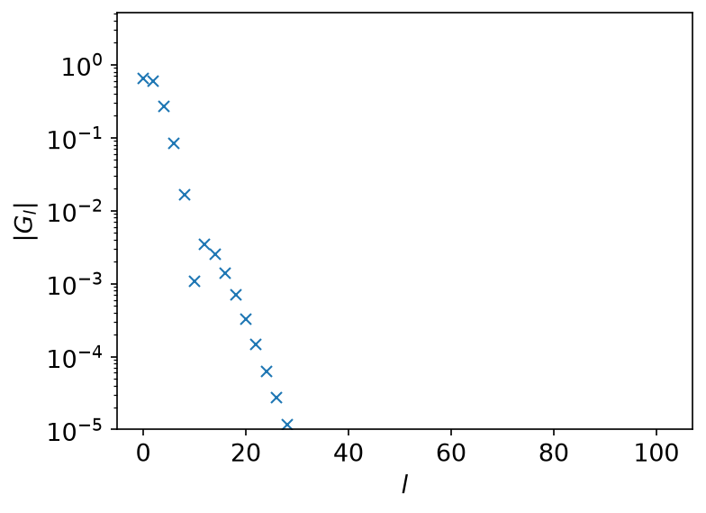
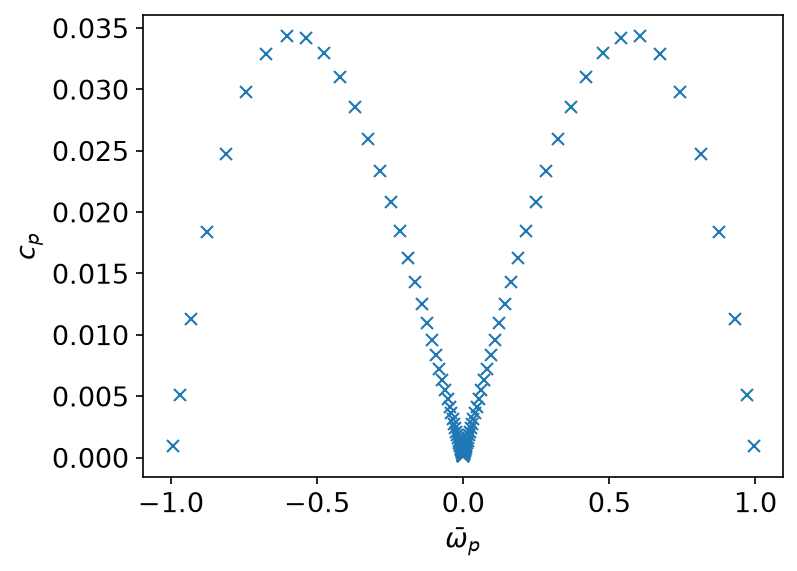
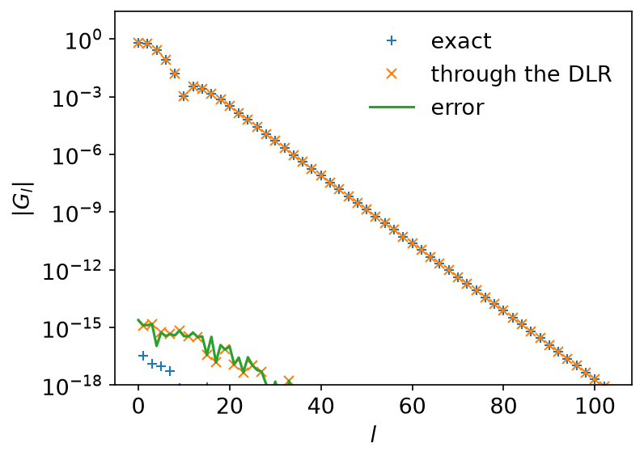
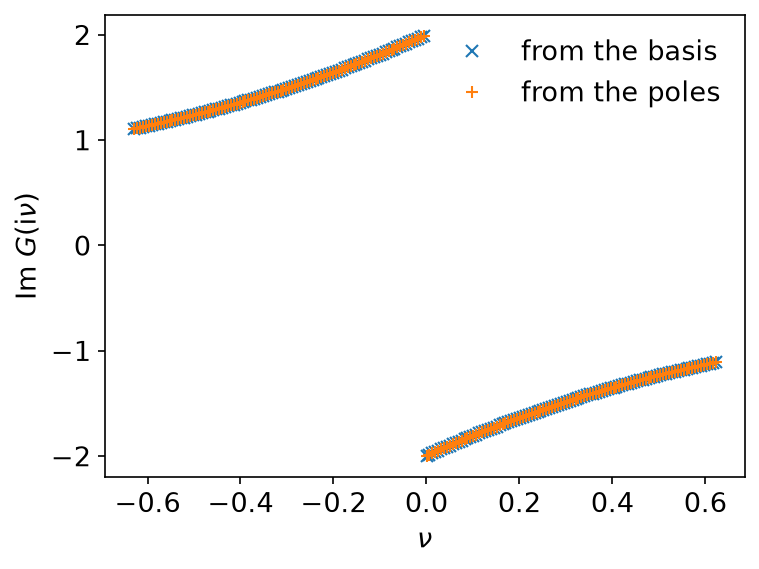

# Discrete Lehmann representation

*Ported from the Python notebook `DLR_py.ipynb` of sparse-ir-tutorial. The
program that produced every number and figure on this page is
`docs/tutorial-code/src/bin/dlr.rs`.*

The IR basis is not the only compact representation of a Green's function. The
discrete Lehmann representation (DLR) models the spectral function as a sum of
delta peaks,

\\[
    \rho(\omega) = \sum_{p=1}^{L} c_p\, \delta(\omega - \bar\omega_p),
\\]

so that on the Matsubara axis

\\[
    G(\mathrm{i}\nu) = \sum_{p=1}^{L} \frac{c_p}{\mathrm{i}\nu - \bar\omega_p}.
\\]

The poles have to come from somewhere. `sparse-ir` takes them to be the roots
of \\(v_L\\), the first basis function beyond the \\(L\\) the truncation kept
— a heuristic choice, but one that makes the matrix
\\(V_{lp} = v_l(\bar\omega_p)\\) well conditioned, so that

\\[
    \rho_l = \sum_p V_{lp}\, c_p
\\]

can be inverted without losing digits. (The original paper picks the poles
more systematically; see Kaye, Chen and Parcollet, *Phys. Rev. B* **105**,
235115 (2022), and Shinaoka *et al.*, arXiv:2106.12685.)

## The model

The same semicircle as the [sparse sampling](sparse_sampling.md) page, at
\\(\Lambda = 10^4\\), \\(\omega_\mathrm{max} = 1\\) and
\\(\varepsilon = 10^{-15}\\) — a basis of 104 functions, and therefore 104
poles.



## Into the DLR and back

```rust
use sparse_ir::{
    Basis, DiscreteLehmannRepresentation, Fermionic, FiniteTempBasis, LogisticKernel,
};

let (beta, wmax) = (1e4, 1.0);
let kernel = LogisticKernel::new(beta * wmax)?;
let basis = FiniteTempBasis::<LogisticKernel, Fermionic>::new(kernel, beta, Some(1e-15), None)?;

let dlr = DiscreteLehmannRepresentation::<Fermionic>::new(&basis)?;
assert_eq!(dlr.poles().len(), basis.size());
# Ok::<(), sparse_ir::Error>(())
```

`from_ir_nd` and `to_ir_nd` are the two directions. They transform one axis of
an array, so a one-dimensional \\(G_l\\) goes in as a rank-1 tensor:

```rust,ignore
use sparse_ir::TypedTensor;

let g_l_tensor = TypedTensor::from_vec_col_major(vec![basis.size()], g_l.clone())?;
let c_p = dlr.from_ir_nd::<f64>(None, &g_l_tensor, 0)?;
let g_l_again = dlr.to_ir_nd::<f64>(None, &c_p, 0)?;
```

The weights sit on the poles like a sampled spectral function — which is what
they are:



The round trip costs nothing but rounding error:



## Why bother

Because of what the poles let you do afterwards. The DLR is an analytic
function of \\(\mathrm{i}\nu\\): evaluating it anywhere is a sum over 104
terms, with no basis functions and no sampling matrix,

```rust,ignore
let g_iv: Complex64 = (0..poles.len())
    .map(|p| c_p.get(&[p]).unwrap() / (Complex64::new(0.0, nu) - poles[p]))
    .sum();
```

and the answer agrees with the basis to the accuracy of the basis — here out
to \\(|n| = 2000\\), far beyond the sampling frequencies:



The same sum works for \\(\tau\\), for real frequencies just above the axis,
and for products of Green's functions, where the pole structure is what makes
the convolution cheap.

## Key API pieces

| What you want | What to call |
| --- | --- |
| the default poles | `DiscreteLehmannRepresentation::new` |
| poles you chose yourself | `DiscreteLehmannRepresentation::with_poles` |
| where the poles are | `poles` |
| \\(G_l \to c_p\\) | `from_ir_nd` |
| \\(c_p \to G_l\\) | `to_ir_nd` |

A `DiscreteLehmannRepresentation` is itself a `Basis`, so `evaluate_tau` and
`evaluate_matsubara` work on it as they do on the IR basis.
