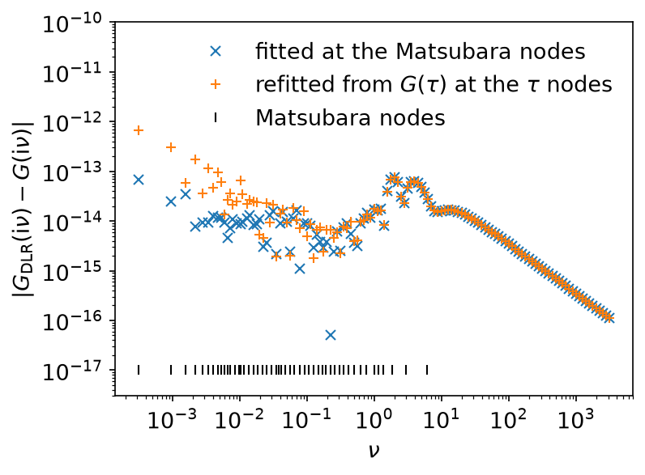

# Discrete Lehmann representation

*Ported from the Python notebook
[`DLR_py.ipynb`](https://spm-lab.github.io/sparse-ir-tutorial-v2/src/DLR_py.html)
of the [sparse-ir tutorials](https://spm-lab.github.io/sparse-ir-tutorial-v2/).
The program that produced every number and figure on this page is
`docs/tutorial-code/src/bin/dlr.rs`.*

The discrete Lehmann representation (DLR) writes a Green's function as a sum
of poles on a fixed set of real frequencies \\(\omega_p\\):

\\[
    G(\mathrm{i}\nu) = \sum_{p} \frac{c_p\, w_p}{\mathrm{i}\nu - \omega_p},
    \qquad
    w_p = \begin{cases} 1 & \text{(fermions)},\\
                        \tanh(\beta\omega_p/2) & \text{(bosons)}.\end{cases}
\\]

For fermions this is the spectral function
\\(\rho(\omega) = \sum_p c_p\, \delta(\omega - \omega_p)\\) of delta peaks.
For bosons the logistic kernel expands \\(\rho(\omega)/\tanh(\beta\omega/2)\\)
rather than \\(\rho(\omega)\\) (see
[Transformation from and to IR](transformation.md#poles)), and the
\\(c_p\\) are the weights of that function, so the residue of pole \\(p\\) is
\\(c_p w_p\\), not \\(c_p\\). `DiscreteLehmannRepresentation::pole_weights()`
returns the \\(w_p\\).

Like the IR basis, the DLR does not depend on the Green's function: build it
once for \\(\beta\\), \\(\omega_\mathrm{max}\\) and \\(\varepsilon\\), and
expand any \\(G\\) in it.

There are two ways to choose the poles. The default,
`DiscreteLehmannRepresentation::new(beta, wmax, eps)`, needs no IR basis. If
you already work with an IR basis, `from_ir` builds a DLR from it and gives you
the transform between the two sets of coefficients.

## A DLR without an IR basis

`DiscreteLehmannRepresentation::new` picks the poles by an interpolative
decomposition (ID) of the logistic kernel, discretized on a fine grid of
\\(\tau\\) and \\(\omega\\): a column-pivoted Gram–Schmidt keeps adding poles
until the rest of the kernel lies within \\(\varepsilon\\) of their span. This
is the construction of Kaye, Chen and Parcollet, *Phys. Rev. B* **105**,
235115 (2022). `DlrBuilder` does the same with a few more options, such as an
upper bound on the number of poles.

The model is the semicircle of the [sparse sampling](sparse_sampling.md) page,

\\[
    \rho(\omega) = \frac{2}{\pi}\sqrt{1-\omega^2},
    \qquad
    G(\mathrm{i}\nu) = 2\mathrm{i}\left(\nu - \operatorname{sgn}(\nu)\sqrt{\nu^2+1}\right),
\\]

at \\(\beta = 10^4\\), \\(\omega_\mathrm{max} = 1\\) and
\\(\varepsilon = 10^{-14}\\). The ID keeps 98 poles.

The DLR also chooses its own sampling points: as many Matsubara frequencies
(`matsubara_nodes`) and as many imaginary times (`tau_nodes`) as it has poles,
again by an ID. `MatsubaraSampling::new(&dlr)` and `TauSampling::new(&dlr)`
sample there, exactly as they sample at the default points of an IR basis. So
the whole workflow is: build, sample \\(G\\) at the nodes, fit.

```rust
{{#include ../../../tutorial-code/src/bin/dlr.rs:independent_build}}
{{#include ../../../tutorial-code/src/bin/dlr.rs:independent_fit}}
# Ok::<(), Box<dyn std::error::Error>>(())
```

The nodes are `MatsubaraFreq` values, so `freq.value(beta)` is
\\(\nu_n = n\pi/\beta\\) with the reduced index \\(n\\), odd for fermions (see
[Conventions](../getting-started/conventions.md#matsubara-frequencies-the-reduced-index)).
`fit_real` asks for real coefficients, which is right here because
\\(\rho\\) is real.

Once fitted, the DLR can be evaluated at any frequency. Here it is evaluated at
odd \\(n\\) from 1 to about \\(10^7\\), far beyond the nodes, and compared with
the closed form:

```rust,ignore
{{#include ../../../tutorial-code/src/bin/dlr.rs:independent_eval}}
```

The imaginary-time nodes work the same way. There is no closed form for
\\(G(\tau)\\) of the semicircle, so the program takes \\(G(\tau)\\) at
`tau_nodes` from the first fit and fits the coefficients again from those
values alone. The sum rule \\(G(0^+) + G(\beta^-) = -\int \rho = -1\\) is an
independent check of the \\(\tau\\) side:

```rust,ignore
{{#include ../../../tutorial-code/src/bin/dlr.rs:independent_tau}}
```

Both fits reproduce \\(G(\mathrm{i}\nu)\\) to better than \\(10^{-12}\\) on the
whole axis (largest error \\(7.6 \times 10^{-14}\\) for the Matsubara fit,
\\(6.7 \times 10^{-13}\\) for the fit from \\(G(\tau)\\)), and the sum rule
holds to \\(3.5 \times 10^{-13}\\):



The coefficients themselves are not well determined: the condition numbers of
these node matrices are large, and two fits can give different \\(c_p\\) that
produce the same \\(G\\). Compare values of \\(G\\), not coefficients.

\\(\varepsilon\\) decides the number of poles, and asking for too much does
not pay. At \\(\varepsilon = 10^{-15}\\) the ID returns 192 poles instead of 98, the
node matrices become numerically singular (`condition_number` returns
infinity), and \\(G(\mathrm{i}\nu)\\) comes out no more accurate. At this \\(\Lambda\\),
\\(10^{-14}\\) is about as small as \\(\varepsilon\\) usefully goes in double
precision.

## A DLR from an IR basis

If your calculation already uses an IR basis, `from_ir` builds a DLR from it.
The poles are the roots of \\(v_L(\omega)\\), the first basis function the
truncation discarded, so there are exactly `basis.size()` of them, one per
basis function, whatever \\(\varepsilon\\) the basis was built with. This
choice is heuristic, but it makes the matrix \\(v_l(\omega_p)\\) well
conditioned, so that the IR and DLR coefficients convert into each other
without losing digits.

The model is the same semicircle at \\(\Lambda = 10^4\\),
\\(\omega_\mathrm{max} = 1\\) and \\(\varepsilon = 10^{-15}\\): a basis of
104 functions, and therefore 104 poles. These are the exact IR coefficients
\\(g_l\\):


```rust,ignore
{{#include ../../../tutorial-code/src/bin/dlr.rs:basis}}
{{#include ../../../tutorial-code/src/bin/dlr.rs:from_ir}}
```

An IR-derived DLR carries the transform to its source basis. `from_ir_nd` and
`to_ir_nd` are the two directions. They transform one axis of an array, so a
one-dimensional \\(g_l\\) goes in as a rank-1 tensor:

```rust,ignore
{{#include ../../../tutorial-code/src/bin/dlr.rs:from_ir_nd}}
{{#include ../../../tutorial-code/src/bin/dlr.rs:to_ir_nd}}
```

These two calls exist only on a DLR built by `from_ir` or
`from_ir_with_poles`. On a DLR built by `new` there is no IR basis to convert
to, and they return `Error::NotSupported`; use the DLR's own nodes, as above.

The coefficients sit on the poles like a sampled spectral function, which is
what they are:


The round trip \\(g_l \to c_p \to g_l\\) costs nothing but rounding error:


## Why bother

Because of what the poles let you do afterwards. The DLR is an analytic
function of \\(\mathrm{i}\nu\\). Evaluating it anywhere is a sum over 104
terms, with no basis functions and no sampling matrix:

```rust,ignore
{{#include ../../../tutorial-code/src/bin/dlr.rs:pole_sum}}
```

For fermions \\(w_p = 1\\); written with `pole_weights()`, the same sum is
correct for bosons too. The answer agrees with the IR basis to the accuracy of
the basis, here out to \\(|n| = 2000\\), far beyond the sampling frequencies:


The same sum works for \\(\tau\\), for real frequencies just above the axis,
and for products of Green's functions, where the pole structure is what makes
the convolution cheap.

## Key API pieces

| What you want | What to call |
| --- | --- |
| a DLR without an IR basis (default) | `DiscreteLehmannRepresentation::new(beta, wmax, eps)`, `DlrBuilder` |
| its sampling points | `tau_nodes`, `matsubara_nodes`; or `TauSampling::new(&dlr)`, `MatsubaraSampling::new(&dlr)` |
| values → \\(c_p\\), \\(c_p\\) → values | `fit`, `evaluate` of either sampling object; `MatsubaraSampling::fit_real`, `evaluate_real` for real \\(c_p\\) |
| the default poles of an IR basis | `DiscreteLehmannRepresentation::from_ir` (trait `DlrFromIr`) |
| poles you chose yourself | `DiscreteLehmannRepresentation::from_ir_with_poles` |
| where the poles are | `poles` |
| the weights \\(w_p\\) | `pole_weights` |
| \\(g_l \to c_p\\), \\(c_p \to g_l\\) (IR-derived DLR only) | `from_ir_nd`, `to_ir_nd` |

A `DiscreteLehmannRepresentation` is itself a `Basis`, so `evaluate_tau` and
`evaluate_matsubara` work on it as they do on the IR basis.

## Running it

From `docs/tutorial-code`:

```bash
cargo run --profile ci --bin dlr
uv run --project ../plotting python ../plotting/dlr_plot.py
```
