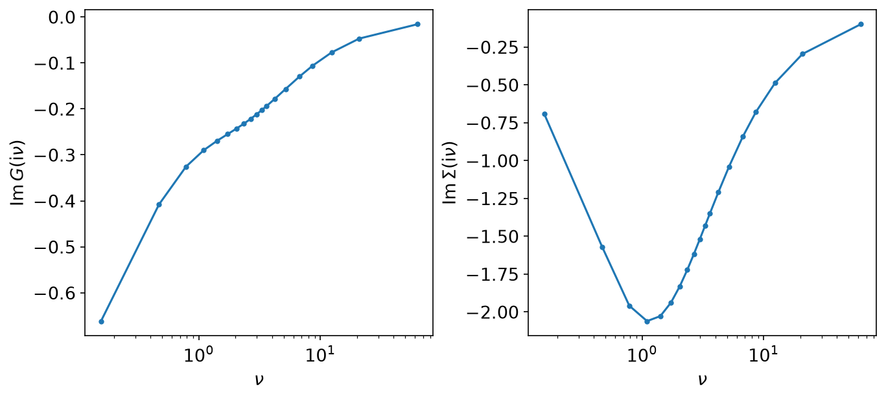
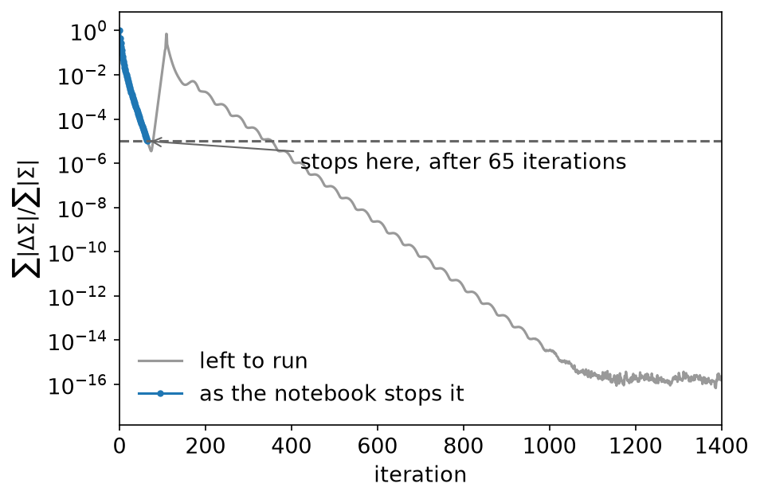
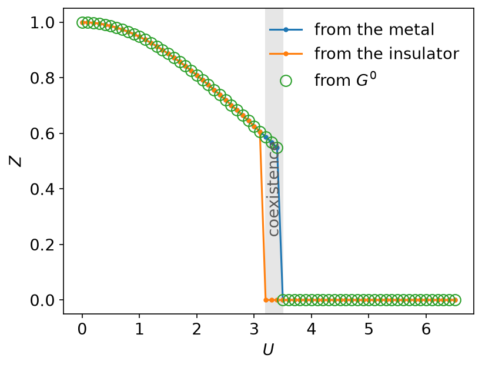
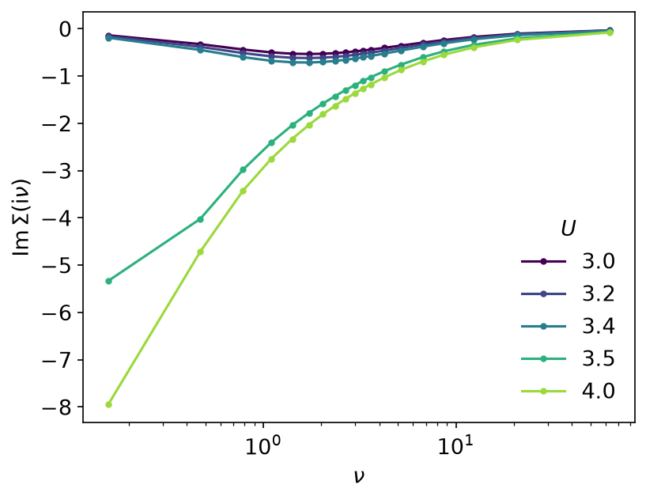

# DMFT with an IPT solver

*Ported from the Python notebook `DMFT_IPT_py.ipynb` of sparse-ir-tutorial,
whose author is Niklas Witt. The programs that produced every number and
figure on this page are `docs/tutorial-code/src/bin/dmft_ipt.rs` and
`docs/tutorial-code/src/bin/dmft_ipt_scan.rs`.*

Every applied page so far computed something once. This one iterates: a
self-consistency loop that goes through the basis twice per step, several
thousand times over. That makes it the page where the basis has to be cheap,
and the page where "has it converged?" turns out to be the hard question.

## The model and the loop

Dynamical mean-field theory replaces a lattice problem by a single impurity
in a bath that is fixed by demanding that the impurity's Green's function is
the lattice's local one. On the Bethe lattice, with the semicircular density
of states

\\[
\rho(\omega) = \frac{2}{\pi D^2}\sqrt{D^2 - \omega^2},
\qquad D = 2t_\star = 2,
\\]

the self-consistency condition collapses to one line,

\\[
\mathcal{G}^{-1}(\mathrm{i}\nu) = \mathrm{i}\nu - t_\star^2 G_\mathrm{loc}(\mathrm{i}\nu),
\\]

and iterated perturbation theory approximates the impurity self-energy by the
second-order diagram, which at half filling is just a cube in imaginary time:

\\[
\Sigma(\tau) = U^2 \mathcal{G}(\tau)^3,
\qquad
G_\mathrm{loc}^{-1}(\mathrm{i}\nu) = \mathcal{G}^{-1}(\mathrm{i}\nu) - \Sigma(\mathrm{i}\nu).
\\]

\\(\Sigma\\) is local in \\(\tau\\) and the Dyson equation is local in
\\(\mathrm{i}\nu\\), so each iteration is a round trip between the two
representations — exactly what the basis is for:

```rust,ignore
let g_tau = self.mesh.wn_to_tau(&g_weiss, 1)?;
let sigma_tau: Vec<Complex64> = g_tau.iter().map(|g| u * u * g * g * g).collect();
let fresh = self.mesh.tau_to_wn(&sigma_tau, 1)?;
```

At \\(\beta = 20\\), \\(\omega_\mathrm{max} = 2D = 4\\) and
\\(\varepsilon = 10^{-15}\\) the basis has 37 functions, with 37 sampling
times and 38 sampling frequencies. That is the entire state of the
calculation: 37 coefficients carry a function whose Matsubara tail reaches
out to \\(\nu \sim 10^2\\), and the round trip is two small dense solves.
Nothing in the loop grows with \\(\beta\\) except logarithmically, which is
what makes a 5000-iteration run a matter of seconds.

The non-interacting starting point comes from the same basis, since the
semicircle has an exact overlap with \\(V_\ell\\):

```rust,ignore
// G⁰(iν) = ∫dω ρ(ω)/(iν − ω), with ρ_l = ∫dω V_l(ω) ρ(ω) done analytically.
let rho = shifted_semicircle_overlaps(self.basis(), 0.0, self.d, 1.0)?;
let g0_l: Vec<Complex64> = /* −s_l ρ_l */;
self.mesh.l_to_wn(&g0_l, 1)
```

The mixing is the notebook's: \\(\Sigma \leftarrow 0.25\,\Sigma_\mathrm{new}
+ 0.75\,\Sigma_\mathrm{old}\\).

## One solve at \\(U = 5\\)

Run the loop at \\(U = 5\\) with the notebook's stopping rule — stop when the
relative change of \\(\Sigma\\) falls below \\(10^{-5}\\) — and it stops at
iteration 65, reporting

\\[
Z = \left(1 - \frac{\partial\,\mathrm{Im}\,\Sigma}{\partial \nu}\right)^{-1}
  \approx 0.263,
\\]

a quasiparticle weight of a quarter: a correlated metal. Here is that
solution:



It looks entirely reasonable. It is also wrong. Leave the same loop running
with no stopping rule at all and the residual does this:



The change of \\(\Sigma\\) dips below \\(10^{-5}\\) at iteration 65 — that is
where the criterion fires — then climbs back to order one around iteration
110 and only afterwards settles, reaching \\(10^{-16}\\) by iteration 1200.
The fixed point it settles on has \\(Z = 0\\): at \\(U = 5\\) and
\\(T = 0.05\\) this model is a Mott insulator, not a metal.

Nothing went wrong numerically. The trajectory passes close to the *unstable*
fixed point that separates the two solutions, and near it the step size is
tiny while the distance still to travel is not. A criterion that measures how
much \\(\Sigma\\) moved cannot tell a plateau from an answer. The escape is
also the one place in this calculation where rounding is visible: the
reference implementation leaves at iteration 107 and this one at 109, because
a \\(10^{-16}\\) difference grows by some 40% per iteration while the
trajectory is being pushed away from the unstable point. The verification for
this example therefore checks the 65-iteration numbers to \\(5\times10^{-6}\\)
rather than to machine precision, and checks the long run by its shape — the
rebound above 0.1, the final residual below \\(10^{-15}\\) — rather than
iteration by iteration.

The moral is not specific to IR: any self-consistency loop near a phase
boundary can stop on a plateau. The cure used below is the blunt one, and it
works because the basis makes iterations cheap.

## Scanning \\(U\\): the Mott transition and its hysteresis

`dmft_ipt_scan` sweeps \\(U\\) from 0 to 6.5 in 66 steps, three times:

- starting each \\(U\\) from the non-interacting \\(G^0\\);
- sweeping upwards, starting each \\(U\\) from the previous solution (the
  *metal* branch);
- sweeping downwards from \\(U = 6.5\\) (the *insulator* branch).

Every solve runs a fixed 5000 iterations with no stopping rule, for the
reason above. Nothing on the grid takes anywhere near that long to settle —
the slowest escape observed was between iterations 2000 and 4000, at the edge
of the coexistence window — and with the criterion removed the three branches
reproduce across implementations to \\(10^{-14}\\), where the criterion-based
version disagreed at the first decimal.



\\(Z\\) falls smoothly from 1 and then drops to zero, but not at the same
\\(U\\) going up as coming down. Below \\(U_{c1} = 3.2\\) only the metal
exists; above \\(U_{c2}\\), which lies between 3.4 and 3.5, only the
insulator does; in between both are stable and which one you get depends on
where you started. That shaded window is the first-order Mott transition, and
it is not an artifact of stopping early: solutions inside it sit at a
residual of \\(5\times10^{-17}\\) and stay there for thousands of further
iterations.

Starting from \\(G^0\\) lands on the metal branch wherever the metal exists —
the `from_g0` and `metal` columns agree to \\(10^{-15}\\) across the whole
grid — which is why a naive scan sees only \\(U_{c2}\\) and misses the
hysteresis entirely.

The self-energies on either side make the distinction concrete:



At \\(U = 3.0, 3.2, 3.4\\) — metallic — \\(\mathrm{Im}\,\Sigma\\) heads to
zero with \\(\nu\\), a Fermi liquid. At \\(U = 3.5\\) and \\(U = 4.0\\) it
diverges as \\(\nu \to 0\\), which is the pole at the Fermi level that opens
the Mott gap.

One curiosity worth naming, since it is visible in the raw output: the
insulating fixed point comes as a particle-hole-conjugate pair, and which of
the two a run lands on is decided by rounding. \\(\mathrm{Re}\,\Sigma\\)
flips sign between the two; \\(\mathrm{Im}\,\Sigma\\), \\(G\\) and \\(Z\\) do
not, so nothing physical depends on it.

## Running it

`dmft_ipt` takes about a second. `dmft_ipt_scan` is 198 self-consistent
solves of 5000 iterations each, which is closer to half a minute, so it is
gated out of the ordinary test run:

```console
$ SPARSEIR_TUTORIAL_RUN=1 SPARSEIR_TUTORIAL_SCANS=1 cargo test --release \
      --test tutorial_binaries --test verification
```

or `scripts/check.sh --run --scans --release`.

## Key API pieces

| What you want | What to call |
| --- | --- |
| \\(\tau \to \mathrm{i}\nu\\) and back, once per iteration | `IrMesh::tau_to_wn`, `IrMesh::wn_to_tau` |
| a semicircular \\(G^0\\) without quadrature | `shifted_semicircle_overlaps`, then `IrMesh::l_to_wn` |
| \\(\Sigma(\tau)\\) for plotting | `IrMesh::wn_to_l`, then `IrMesh::l_to_tau` |
| the lowest Matsubara frequency | the index of \\(n = 1\\) in `IrMesh::wn` |
