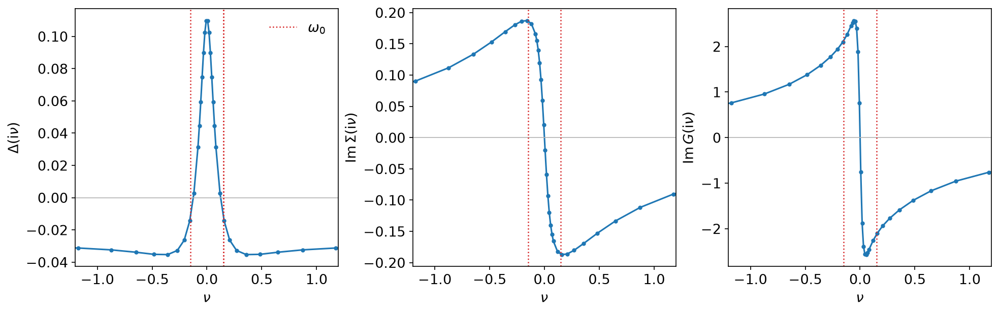
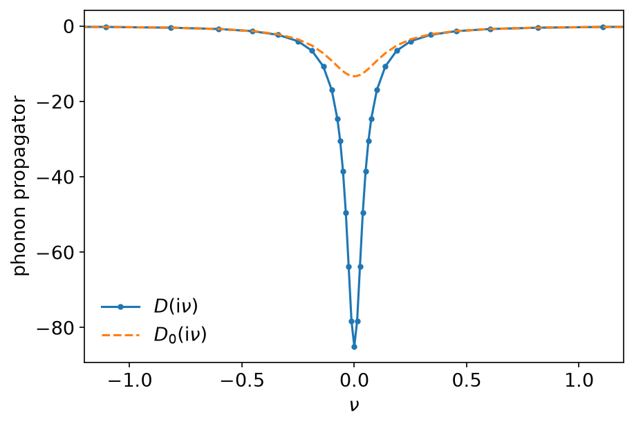
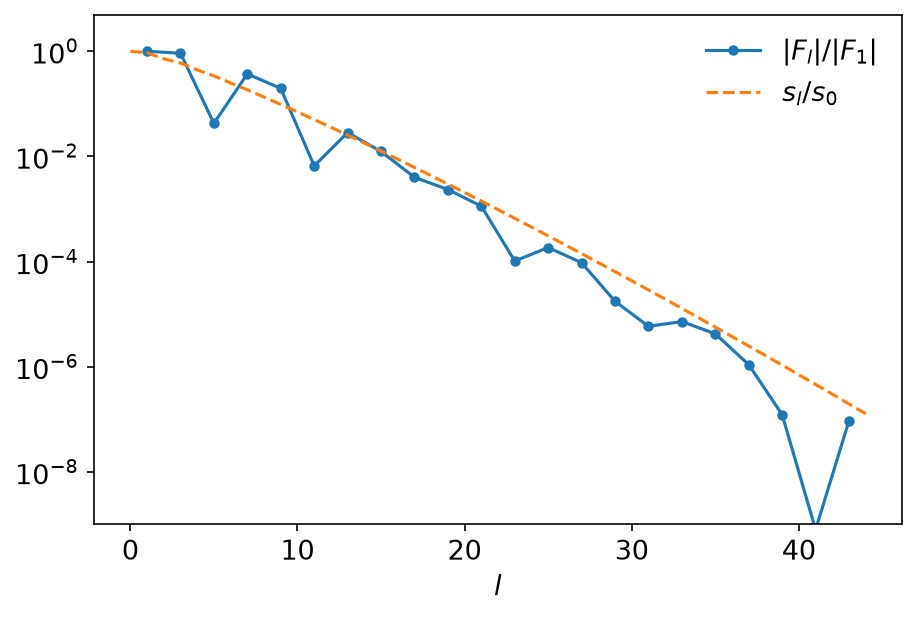
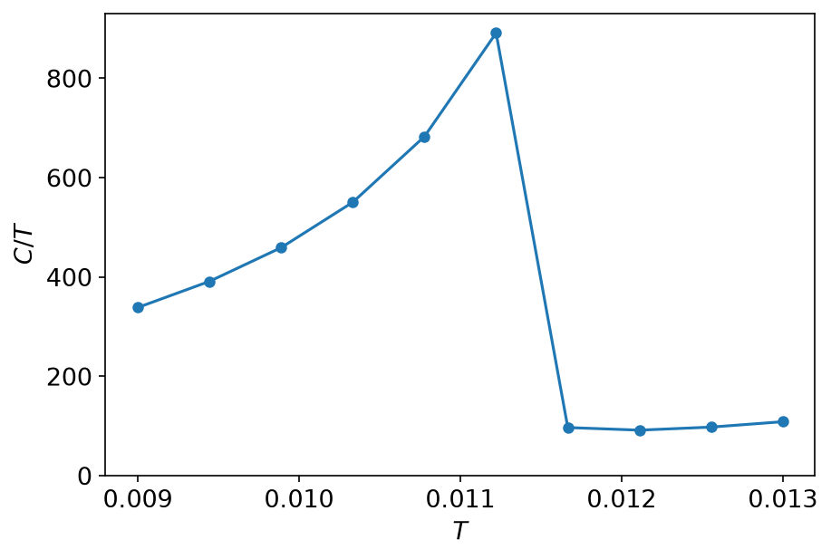

# Eliashberg theory

*Ported from the Python notebook `eliashberg_holstein_py.ipynb` of
sparse-ir-tutorial, whose authors are Shintaro Hoshino and Hiroshi Shinaoka.
The programs that produced every number and figure on this page are
`docs/tutorial-code/src/bin/eliashberg_holstein.rs` and
`docs/tutorial-code/src/bin/eliashberg_holstein_scan.rs`.*

Every applied example so far has carried a momentum index. This one does not.
The model is a band of electrons — a semicircular density of states of half
bandwidth \\(D = 0.5\\) — coupled to a local phonon of frequency
\\(\omega_0 = 0.15\\), and every self-energy in it is local, so the momentum
dependence collapses into a single quadrature over \\(\omega\\). What is left
is the smallest self-consistent calculation the basis is useful for, and the
one where its compactness is easiest to see: at \\(\beta = 500\\) the whole
solution — four functions of frequency — lives in 45 basis functions.

## The equations

The electrons are described by the normal \\(G\\) and the anomalous \\(F\\),
which in the superconducting state are both non-zero:

\\[
G(\mathrm{i}\nu) = \int\\!\mathrm{d}\omega\\,\rho(\omega)\\,
  \frac{\xi(\mathrm{i}\nu) + \omega}
       {\xi(\mathrm{i}\nu)^2 - \Delta(\mathrm{i}\nu)^2 - \omega^2},
\qquad
F(\mathrm{i}\nu) = \int\\!\mathrm{d}\omega\\,\rho(\omega)\\,
  \frac{\Delta(\mathrm{i}\nu)}
       {\xi(\mathrm{i}\nu)^2 - \Delta(\mathrm{i}\nu)^2 - \omega^2},
\\]

with \\(\xi = \mathrm{i}\nu + \mu - \Sigma\\). The phonon is dressed by the
electrons it couples to, and dresses them back:

\\[
\Pi(\tau) = -4g_0^2\left[G(\tau)G(\beta - \tau) + F(\tau)^2\right],
\qquad
D = \left(D_0^{-1} - \Pi\right)^{-1},
\\]
\\[
\Sigma(\tau) = -4g_0^2\\,D(\tau)G(\tau),
\qquad
\Delta(\tau) = 4g_0^2\\,D(\tau)F(\tau) + (U + 2J)\\,F(0^+)\delta(\tau).
\\]

The instantaneous \\((U + 2J)F(0^+)\\) is the Coulomb repulsion, which fights
the phonon; the rest is retarded, and it is that retardation that lets
superconductivity survive a bare repulsion of \\(U = 2\\) against a phonon of
\\(\omega_0 = 0.15\\).

One pass of the loop is therefore four transforms and three products:

```rust,ignore
let (g_iv, f_iv) = self.green();
let mut g_tau = mesh_f.wn_to_tau(&g_iv, 1)?;
let f_tau = mesh_f.wn_to_tau(&f_iv, 1)?;
// ... Π(τ) from g_tau and f_tau ...
self.phi_iv = mesh_b.tau_to_wn(&phi_tau, 1)?;
self.d_tau = mesh_b.wn_to_tau(&self.d_iv, 1)?;
let sigma_new = mesh_f.tau_to_wn(&sigma_tau, 1)?;
```

The bosonic \\(\Pi\\) is built from values sampled at the *fermionic* times,
which only works because both bases come from one singular value expansion and
therefore share a \\(\tau\\) grid. `Bases` is that pair, and here it is
used without a lattice around it:

```rust,ignore
let bases = Bases::new(BETA, WMAX, EPS)?;
```

## Two conventions worth pausing on

The notebook samples \\(\tau\\) on \\([0, \beta)\\); `sparse-ir` samples it on
\\([-\beta/2, \beta/2]\\). Two lines of the notebook are statements about the
grid rather than about the physics, and both need rereading here.

The first is `g_tau[::-1]`, which on a grid symmetric about \\(\beta/2\\) is
\\(G(\beta - \tau)\\). On the symmetric grid it is a permutation *with a
sign*, because \\(G(\beta - \tau) = -G(-\tau)\\); `IrMesh::reverse_tau` is
exactly that, and it is what both the particle-hole symmetrisation and
\\(\Pi\\) are written in terms of.

The second is `g_tau[g_tau > 0] = 0`, which clips round-off off a function
that is negative throughout \\([0, \beta)\\). On \\([-\beta/2, \beta/2]\\) the
negative half of the grid holds *positive* values — for precisely the reason
that makes the clip correct — so the sign has to be undone before the
comparison:

```rust,ignore
let folded = if tau > 0.0 { *value } else { -*value };
if folded.re > 0.0 || (folded.re == 0.0 && folded.im > 0.0) {
    *value = Complex64::default();
}
```

Getting this wrong is not a small error: clipping the negative half to zero
kills the \\(G(\tau)G(\beta - \tau)\\) term of \\(\Pi\\) outright, and the
loop then converges happily to the normal state instead.

## One solve at β = 500

`eliashberg_holstein` starts \\(\Sigma\\) from a committed noise file — the
normal state solves these equations too, so a loop started exactly on it never
leaves — and settles in 171 iterations at a mixing of \\(0.3\\) and a
threshold of \\(10^{-10}\\). The basis is 45 functions for each statistics, on
46 fermionic and 45 bosonic frequencies, at \\(\varepsilon = 10^{-7}\\).



The gap is \\(\Delta(\mathrm{i}\pi T) = 0.1098\\), comfortably above
\\(\omega_0/2\\), and it does not simply decay: it crosses zero just outside
\\(\pm\omega_0\\) (the dotted lines) and reaches \\(-0.0353\\) before flattening
out at \\(-0.0292\\). That negative tail *is* the Coulomb pseudopotential
mechanism — the repulsion is pushed up to frequencies where the phonon no
longer helps, and the low-frequency gap is left positive.



The phonon the electrons hand back is much softer than the one they were
given: \\(D(0) = -85.0\\) against a bare \\(-2/\omega_0 = -13.3\\), a factor of
6.4. Away from \\(|\nu| \gtrsim 2\omega_0\\) the two are indistinguishable.

## Compactness, checked

The reason all of this fits in 45 numbers is the same reason it fits in the
basis at all, and the anomalous Green's function makes the point cleanly:



\\(F\\) is even in \\(\nu\\), so only odd \\(\ell\\) carry weight — the even
coefficients sit at \\(10^{-15}\\), which is the round-off of the transform.
What is left tracks \\(s_\ell/s_0\\) over eight orders of magnitude and stops
where the expansion was truncated. A Matsubara sum reaching
\\(\nu = \pm 34.7\\), which is where the sampling frequencies end, would have
needed thousands of points to say the same thing.

## The specific heat across the transition

The internal energy is a Matsubara sum of three terms, each needing a
convergence factor \\(e^{\mathrm{i}\nu 0^+}\\); in the basis that is a fit
followed by one evaluation at \\(\tau = 0\\), the same trick the TPSC sum
rules use. Its temperature derivative is the specific heat, so
`eliashberg_holstein_scan` solves the model twice at each of ten
temperatures — at \\(T\\) and at \\(T + 10^{-5}\\) — and takes the difference
quotient. At the stronger coupling \\(\lambda_0 = 0.175\\) the transition
falls inside \\(T \in [0.009, 0.013]\\).

The sweep holds \\(\Lambda = \beta\omega_\mathrm{max} = 555.6\\) fixed, so one
expansion serves all twenty solves and the basis stays 36 functions
throughout — which is what makes it safe to start each solve from the solution
before it:

```rust,ignore
let (kernel, sve) = sve_for(1.0 / T_MIN, lambda_ir * T_MIN, EPS)?;
for &temperature in &temperatures {
    let bases = Bases::from_sve(kernel, sve.clone(), 1.0 / temperature, EPS)?;
    // ... start from the previous Σ and Δ ...
}
```



\\(C/T\\) climbs from 338 at \\(T = 0.009\\) to 891 at \\(T = 0.011222\\) and
then falls off a cliff, to 96.7 one step later: the superconducting
transition sits between those two temperatures. Above it \\(C/T\\) is flat and
small, which is the normal state of a weakly coupled metal. The approach to
the transition is also where the loop works hardest — 4476 iterations at the
last superconducting point, against a dozen well above \\(T_c\\), the usual
critical slowing down of a self-consistent solver.

## Running it

`eliashberg_holstein` is one solve and takes well under a second;
`eliashberg_holstein_scan` is twenty solves, several of them slow, and takes a
couple of seconds, so it is registered as a parameter scan:

```console
$ SPARSEIR_TUTORIAL_RUN=1 SPARSEIR_TUTORIAL_SCANS=1 cargo test --release \
      --test tutorial_binaries --test verification
```

or `scripts/check.sh --run --scans --release`.

## Key API pieces

| What you want | What to call |
| --- | --- |
| both statistics from one expansion | `Bases::new`, or `sve_for` then `Bases::from_sve` |
| one pass of the loop | `IrMesh::wn_to_tau`, multiply, `IrMesh::tau_to_wn` |
| \\(G(\beta - \tau)\\) on the symmetric grid | `IrMesh::reverse_tau` |
| a Matsubara sum with \\(e^{\mathrm{i}\nu 0^+}\\) | `IrMesh::wn_to_l`, then `evaluate_rows` on \\(U^F_\ell(0)\\) |
| an integral over a density of states | `gauss_legendre` from `tutorial::quad` |
| the same basis at every temperature | fix \\(\Lambda\\) and vary \\(\beta\\) |
