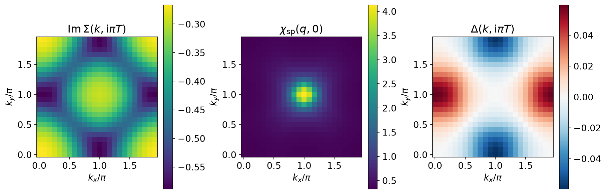
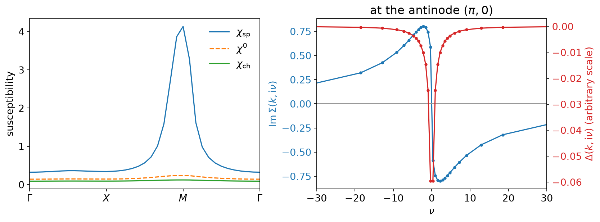
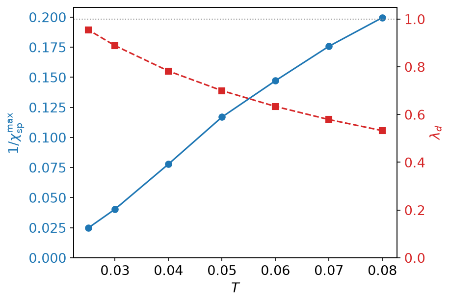
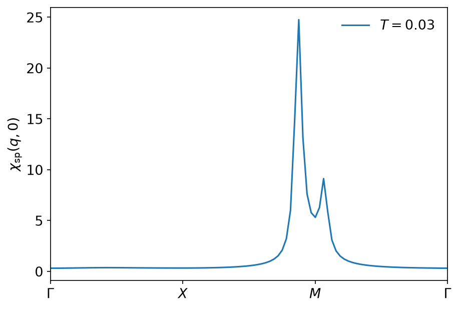

# Fluctuation exchange

*Ported from the Python notebook
[`FLEX_py.ipynb`](https://spm-lab.github.io/sparse-ir-tutorial-v2/src/FLEX_py.html)
of the [sparse-ir tutorials](https://spm-lab.github.io/sparse-ir-tutorial-v2/),
whose author is Niklas Witt. The programs that produced every number and
figure on this page are `docs/tutorial-code/src/bin/flex.rs` and
`docs/tutorial-code/src/bin/flex_scan.rs`; the solver is in
`docs/tutorial-code/src/flex.rs`, and the code below is included from there.*

The previous page fixed its vertices by solving two scalar equations and never
iterated. The fluctuation-exchange approximation goes the other way: the
interaction stays the bare \\(U\\), and everything is decided by a Dyson loop
that is run until the self-energy stops moving. What makes it belong here is
that each pass of that loop is a handful of products in \\((\tau, r)\\) with
basis transforms between them — the frequency dependence never appears as a
truncated sum.

## One loop, four transforms

FLEX sums the particle-hole bubble and ladder series, which in a single band
collapses to a self-energy built from the same irreducible \\(\chi^0\\) as on
the TPSC page, dressed twice:

\\[
\chi_\mathrm{sp} = \frac{\chi^0}{1 - U\chi^0},
\qquad
\chi_\mathrm{ch} = \frac{\chi^0}{1 + U\chi^0},
\qquad
V = U^2\left(\tfrac32 \chi_\mathrm{sp} + \tfrac12 \chi_\mathrm{ch}
            - \chi^0\right),
\\]

\\[
\Sigma(\tau, r) = V(\tau, r)\, G(\tau, r),
\qquad
G(\mathrm{i}\nu, k) = \bigl[\mathrm{i}\nu - (\varepsilon_k - \mu)
                            - \Sigma(\mathrm{i}\nu, k)\bigr]^{-1}.
\\]

Here \\(\mathrm{i}\omega\\) is a bosonic and \\(\mathrm{i}\nu\\) a fermionic
Matsubara frequency, as in the [conventions](../getting-started/conventions.md).
Read as code, one step is: dress \\(\chi^0\\) in \\((\mathrm{i}\omega, q)\\),
carry \\(V\\) to \\((\tau, r)\\), multiply by \\(G(\tau, r)\\), carry the
product back to \\((\mathrm{i}\nu, k)\\).

```rust,ignore
{{#include ../../../tutorial-code/src/flex.rs:flex_interaction}}

{{#include ../../../tutorial-code/src/flex.rs:flex_self_energy}}
```

The bosonic mesh fits the interaction and the fermionic one fits the
self-energy, on the same \\(\tau\\) grid — the point the
[TPSC page](tpsc.md) already relied on. The two grids coincide because the logistic
kernel gives both statistics the same \\(u_l(\tau)\\); sharing one SVE between
them only saves the second expansion.

Written in full, \\(V\\) would also carry the first-order term, a bare
instantaneous \\(U\\) (a \\(\delta(\tau)\\) term). It is left out: it is frequency
independent, so the basis is the wrong tool for it, and in \\(\Sigma\\) it would
be the Hartree shift \\(Un/2\\), which in a single band is a shift of the
chemical potential, refitted at every step anyway. That omission comes back
in the gap equation below.

## Keeping the denominator positive

Nothing forces \\(1 - U\chi^0\\) to stay positive along the way to the fixed
point, and \\(\chi^0\\) evaluated on the *non-interacting* Green's function is
the largest it will ever be. At \\(U = 4\\) the starting point does violate
it, so the interaction is walked up instead of being switched on at once:

```rust,ignore
{{#include ../../../tutorial-code/src/flex.rs:renormalise}}
```

Each pass runs one FLEX step at the largest interaction the current
\\(\chi^0\\) can carry, which shrinks \\(\chi^0\\); the target \\(U\\) is then
retried. The loop is capped, because there is no guarantee it ever succeeds:
a genuinely ordered system has no FLEX solution to walk towards. At
\\(T = 0.1\\) six passes are enough; the number is written out as
`renormalisation_steps`.

## One solve at U = 4

`flex` takes a \\(24 \times 24\\) lattice at \\(\beta = 10\\), filling
\\(n = 0.85\\), \\(U = 4\\), \\(\varepsilon = 10^{-10}\\) and a linear mixing
of \\(0.2\\), and runs 30 steps. The basis has 30 functions for each
statistics: 30 \\(\tau\\) points, 30 fermionic and 31 bosonic frequencies. The
relative movement of \\(\Sigma\\) in the last step is \\(1.3\times10^{-5}\\),
and \\(\mu = -0.6713\\).



\\(|\mathrm{Im}\,\Sigma|\\) is largest at the antinodes \\((\pi, 0)\\) and
smallest along the diagonal — the momentum-selective scattering that opens a
pseudogap — and \\(\chi_\mathrm{sp}\\) is piled up at \\(M = (\pi, \pi)\\),
enhanced there by a factor of \\(17.5\\) over \\(\chi^0\\) against \\(2.3\\)
at \\(\Gamma\\).



Against frequency, \\(\mathrm{Im}\,\Sigma\\) is odd, largest in magnitude at
the first Matsubara frequency and decaying from there; the run gives
\\(\mathrm{Im}\,\Sigma(\mathrm{i}\pi T, (\pi,0)) = -0.588\\). Its sign,
opposite to that of \\(\nu\\) at every sampling frequency, is the statement
that the solution is causal.

## The linearised gap equation

With the fluctuations in hand, the question is whether they pair. The
linearised Eliashberg equation

\\[
\lambda\, \Delta(\mathrm{i}\nu, k) = \frac{T}{N_k}
\sum_{\mathrm{i}\nu', k'} V^S(\mathrm{i}\nu - \mathrm{i}\nu', k - k')\,
F(\mathrm{i}\nu', k'),
\qquad
F = -|G|^2\,\Delta,
\\]

is an eigenvalue problem whose leading \\(\lambda\\) reaches 1 at
\\(T_\mathrm{c}\\). (The sign is carried by \\(F\\), as in the code; writing
\\(F = |G|^2\Delta\\) with a minus sign in front of the sum is the same
equation.) The convolution is a plain product \\(V^S(\tau, r)F(\tau, r)\\).
The singlet vertex is *not* the one in the self-energy: the charge
fluctuations enter with the opposite sign,
\\(V^S = U + U^2\left(\tfrac32\chi_\mathrm{sp} - \tfrac12\chi_\mathrm{ch}\right)\\),
of which the code keeps the frequency-dependent part.
Applying it is the same four transforms as one FLEX step, so the power method
costs about what a few self-consistency steps cost, seeded with a
\\(d_{x^2-y^2}\\) gap \\(\cos k_x - \cos k_y\\).

Here the dropped bare \\(U\\) (the \\(\delta(\tau)\\) term of \\(V^S\\))
matters. It contributes exactly zero in the \\(d\\)-wave channel, because such
a gap sums to zero over the zone, but not outside it, and without it the
operator has a spurious mode whose eigenvalue is \\(-1.28\\) — larger in magnitude than \\(\lambda_d\\). The seed has almost
no overlap with it, so the iterate sits on the \\(d\\)-wave answer for tens of
steps and then leaves it. A fixed step count would land right at that
crossover; the loop therefore stops when \\(\lambda\\) moves by less than
\\(10^{-4}\\), which happens after 8 steps with three orders of magnitude to
spare. The step count is written out too.

The result is \\(\lambda_d = 0.4568\\) at \\(T = 0.1\\): the right symmetry,
well short of the transition. The gap in the third panel above changes sign
under \\(k_x \leftrightarrow k_y\\) and vanishes on the zone diagonal; the
eigenvector's overall scale means nothing, only its shape does.

(The \\(\lambda\\) here is an eigenvalue of the gap equation. It is unrelated
to the electron-phonon coupling \\(\lambda_0\\) of the
[Eliashberg page](eliashberg_holstein.md).)

## Cooling towards T_c

`flex_scan` repeats the calculation on a \\(64 \times 64\\) lattice at seven
temperatures from \\(T = 0.08\\) down to \\(0.025\\), with
\\(\Lambda = \beta\omega_\mathrm{max}\\) held at \\(10^3\\) and
\\(\varepsilon = 10^{-8}\\). Holding \\(\Lambda\\) fixed means one SVE serves
every temperature —

```rust,ignore
{{#include ../../../tutorial-code/src/bin/flex_scan.rs:shared_sve}}
// ...
{{#include ../../../tutorial-code/src/bin/flex_scan.rs:lattice_per_beta}}
```

— and that every temperature has a basis of the same 43 functions, which in
turn is what makes it legal to carry the converged \\(\Sigma\\) of one
temperature into the next as a starting point. With that head start, the
renormalisation loop runs only at the first temperature (nine passes) and
never again.



\\(1/\chi_\mathrm{sp}^{\max}\\) falls almost linearly — the Curie–Weiss form —
from \\(0.1996\\) to \\(0.0248\\), extrapolating to zero near \\(T
\approx 0.019\\), while \\(\lambda_d\\) climbs from \\(0.533\\) to
\\(0.955\\) and would reach 1 at about \\(T \approx 0.021\\). The two
temperatures are close because in this approximation it is the spin
fluctuations that do the pairing: the gap equation is driven by the same
\\(\chi_\mathrm{sp}\\) that is diverging.



The finer grid also resolves what the \\(24\times24\\) run could not: at
\\(n = 0.85\\) the peak is *not* at \\(M\\). Nesting is incommensurate, and
\\(\chi_\mathrm{sp}\\) peaks at \\((\pi, 7\pi/8)\\) with the value \\(24.8\\)
against \\(5.3\\) at \\(M\\) itself — a factor of nearly five that a
commensurate grid would have missed entirely.

## Beyond the imaginary axis

FLEX gives \\(\Sigma\\), \\(\chi\\) and \\(\Delta\\) on the sampling
frequencies only. To look at the pseudogap or the gap on the real axis, the
same data have to be continued: see
[analytic continuation](analytic_continuation.md),
[sparse modeling](spm.md) and [MiniPole](minipole.md). The
[DLR](dlr.md) gives a pole representation of the same functions on the
imaginary axis.

## Running it

From `docs/tutorial-code`:

```console
$ cargo run --profile ci --bin flex
$ cargo run --profile ci --bin flex_scan
$ uv run --project ../plotting python ../plotting/flex_plot.py
```

`flex` is one solve and takes under half a second; `flex_scan` is seven solves
on a grid seven times larger and takes a few seconds. The repository's checks
compare the outputs with the Python notebook, including the
renormalisation-pass and power-method step counts, the sign of
\\(\mathrm{Im}\,\Sigma\\) at every frequency, and the symmetry of the gap.

## Key API pieces

From `sparse-ir`:

| What you want | What to call |
| --- | --- |
| one SVE reused across temperatures | `compute_sve` with `LogisticKernel::new(Λ)`, then `FiniteTempBasis::from_sve_result` per \\(\beta\\) |
| \\(u^F_l(0^+)\\) for the filling | `Basis::evaluate_tau(&[0.0])` (\\(+0.0\\) means \\(0^+\\)) |
| fits and evaluations at the sampling points | `TauSampling`, `MatsubaraSampling` (wrapped by `IrMesh`) |

From the tutorial crate (`docs/tutorial-code/src`):

| What you want | Tutorial helper |
| --- | --- |
| one step of a Dyson loop | `IrMesh::wn_to_tau`, `MomentumGrid::k_to_r`, multiply, `MomentumGrid::r_to_k`, `IrMesh::tau_to_wn` |
| \\(\chi^0\\) as a real-space product | `IrMesh::reverse_tau`, then the bosonic `IrMesh::tau_to_wn` |
| the filling \\(n = 2[1 + G(\tau = 0^+)]\\) | `IrMesh::wn_to_l`, then `evaluate_rows` with \\(u^F_l(0^+)\\) |
| the chemical potential at fixed \\(n\\) | `brent` from `tutorial::roots` |
| one SVE reused across temperatures | `sve_for`, then `Lattice::from_sve` per \\(\beta\\) |
| a whole basis at fixed \\(\Lambda\\) | keep \\(\beta\omega_\mathrm{max}\\) constant and vary \\(\beta\\) |
