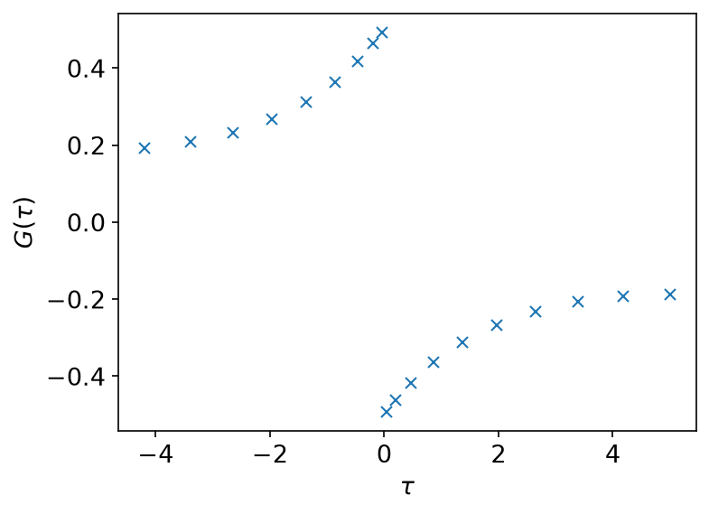
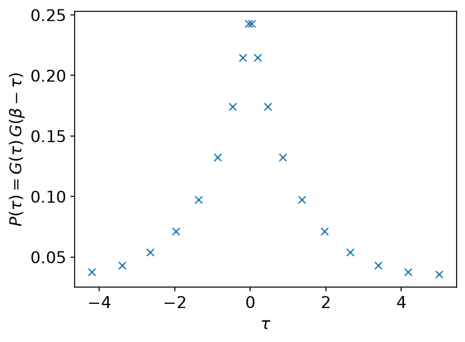
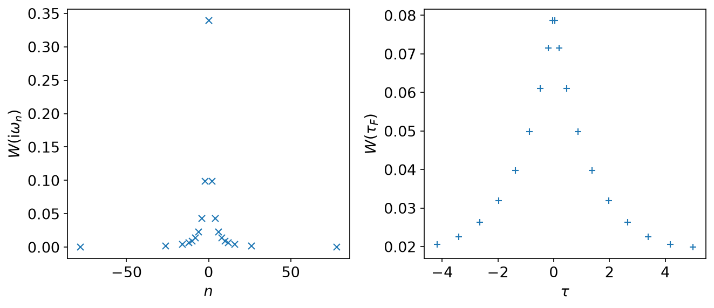
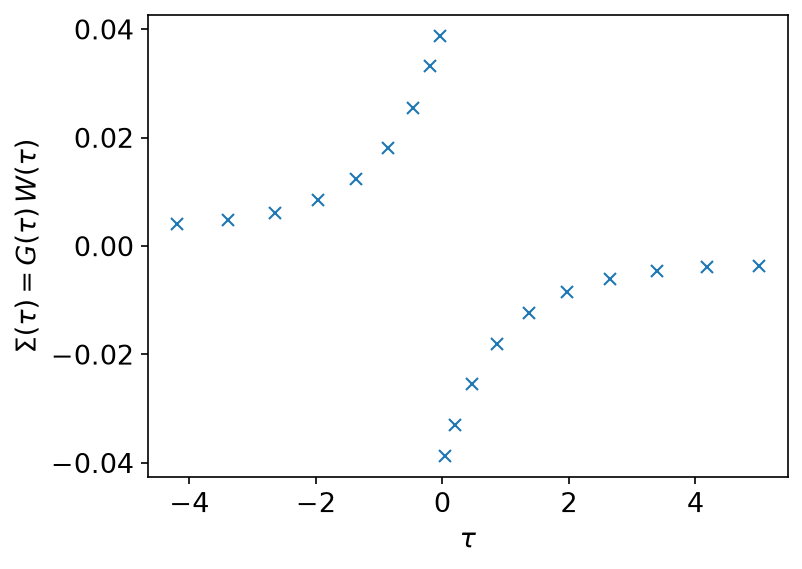
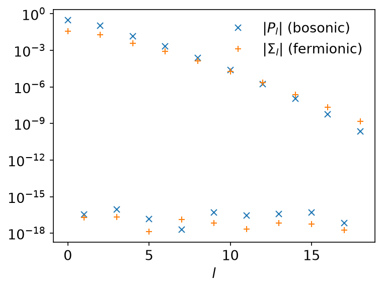
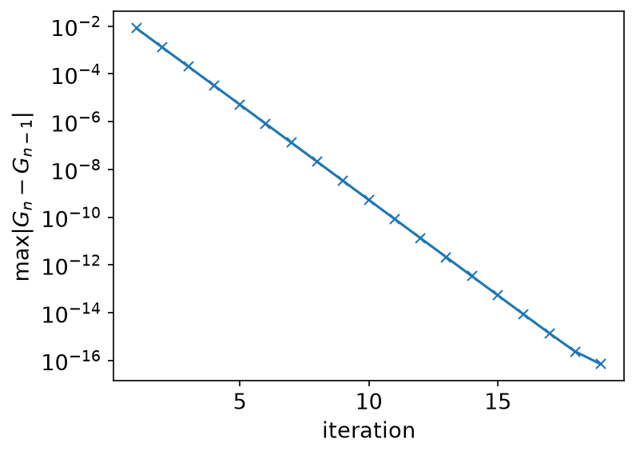
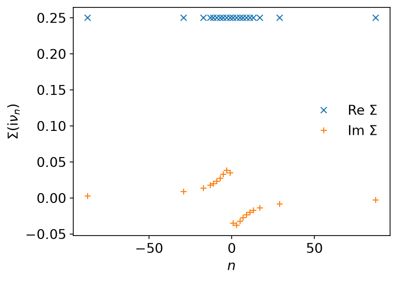
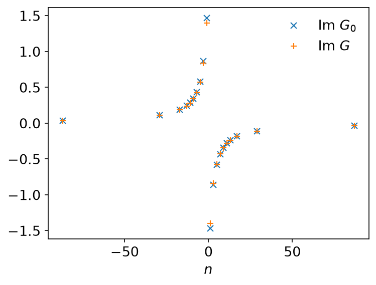

# GW

*Ported from the Python notebook
[`GW_py.ipynb`](https://spm-lab.github.io/sparse-ir-tutorial-v2/src/GW_py.html)
of [sparse-ir-tutorial-v2](https://spm-lab.github.io/sparse-ir-tutorial-v2/).
The program that produced every number and figure on this page is
`docs/tutorial-code/src/bin/gw.rs`; the code below is included from it.*

The previous page evaluated one diagram once. This one runs a self-consistent
loop, and in doing so moves between imaginary time, IR coefficients and
Matsubara frequencies several times per iteration, in both statistics. It
uses the IR basis only.

The parameters are \\(T = 0.1\\) (\\(\beta = 10\\)),
\\(\omega_\mathrm{max} = 1\\), \\(U = 0.5\\), the default accuracy of the
basis, and twenty iterations. The non-interacting \\(G_0\\) has a
semicircular spectral function of half-width 1.

## Theory

The loop follows the structure of Hedin's equations in the \\(GW\\)
approximation, for a single site with a bare interaction \\(U\\). In the
notebook's conventions, which this port keeps, they read

\\[
P(\tau) = G(\tau)\, G(\beta - \tau),
\qquad
W(\mathrm{i}\omega) = \frac{U}{1 - U P(\mathrm{i}\omega)},
\qquad
\Sigma(\tau) = G(\tau)\, W(\tau),
\\]

closed by the Dyson equation
\\(G^{-1} = G_0^{-1} - \Sigma\\). Each of them is diagonal in exactly one
representation: the two products live in imaginary time, the screening is
algebraic on the Matsubara axis, and so is the Dyson equation. One iteration
is therefore a tour:

```text
G(iν) → g_l → G(τ) → P(τ) → P_l → P(iω) → W(iω) → W_l → W(τ) → Σ(τ) → Σ_l → Σ(iν) → G(iν)
```

Here \\(\mathrm{i}\nu\\) is fermionic and \\(\mathrm{i}\omega\\) bosonic.

These signs are not the textbook ones. Since \\(G(\tau) \le 0\\) on
\\((0, \beta)\\), \\(P(\tau) = G(\tau) G(\beta - \tau)\\) is positive; it is
minus the usual single-spin bubble \\(G(\tau) G(-\tau)\\). The textbook
self-energy is \\(\Sigma = -GW\\), with a spin sum in \\(P\\). The two sign
changes cancel at order \\(U^2\\), so the second-order term has the textbook
sign; the higher-order terms of the screening series do not. The
example is about the structure of the loop — which product lives in which
representation — not a quantitatively faithful \\(GW\\) for this model.

Only the constant part of \\(W\\) is split off: what is carried into
\\(\Sigma\\) is \\(U/(1 - UP) - U\\). The instantaneous part \\(U\\) would
give the static term \\(U G(\beta^-) = -U\langle n \rangle\\), with
\\(\langle n\rangle\\) the occupation per spin. In Hedin's equations that is
the exchange (Fock) term, not the Hartree term; the code calls it `hartree`
after the notebook. It is computed separately and kept out of the Dyson
equation, because a constant only shifts the chemical potential.

## Two statistics, one loop

\\(G\\) and \\(\Sigma\\) are fermionic; \\(P\\) and \\(W\\) are bosonic. The
two products mix them: \\(P\\) is a product of \\(G\\)'s evaluated at the
*bosonic* sampling times, and \\(\Sigma\\) needs \\(W\\) at the
*fermionic* ones. So the example carries two bases and two meshes:

```rust,ignore
{{#include ../../../tutorial-code/src/bin/gw.rs:bases}}
```

Both bases use the same kernel, so they could share one singular value
expansion. Calling `FiniteTempBasis::new` twice computes it twice; at
\\(\Lambda = 10\\) that costs nothing, but for a large \\(\Lambda\\) compute the
SVE once and build both bases with `FiniteTempBasis::from_sve_result`, as
[Conventions](../getting-started/conventions.md) shows.

The loop also needs two evaluation matrices, built once outside it, and the
row \\(u_l(\beta^-)\\) for the static term:

```rust,ignore
{{#include ../../../tutorial-code/src/bin/gw.rs:cross}}
```

`Basis::evaluate_tau` is the operation that makes this safe. The sampling
times live on \\([-\beta/2, \beta/2]\\), so evaluating a basis function there
needs the (anti-)periodicity relation — and *which* relation is a property of
the function, never of the grid it is being sampled on. \\(G\\) stays
anti-periodic when evaluated at bosonic times; \\(W\\) stays periodic at
fermionic ones. `evaluate_tau` applies the statistics of the basis it belongs
to, which is exactly right. Doing the same thing by hand — folding the times
and then multiplying by a sign taken from the *grid* — is the mistake this
example exists to rule out.



## The reversal, again

\\(P(\tau) = G(\tau) G(\beta - \tau)\\) needs the same reversal as the
[second-order self-energy](second_order_perturbation.md), and here it has a
wrinkle. At \\(\beta = 10\\), \\(\omega_\mathrm{max} = 1\\) and the default
accuracy, both grids hold 19 points: 18 of them in \\(\pm\\) pairs, and one at
exactly \\(\tau = \beta/2\\). That last point has no partner under
\\(\tau \to -\tau\\) on the grid — its mirror \\(-\beta/2\\) is the same point
one period away. The reversal must therefore allow for a wrap, which brings a
second \\(\zeta\\); at \\(\beta/2\\) the two cancel and the row maps to itself
with a plus sign.

`evaluate_rows` (a tutorial helper) contracts a matrix of basis-function
values with a block of coefficients:

```rust,ignore
{{#include ../../../tutorial-code/src/bin/gw.rs:polarization}}
```

For this particular model the check is worth stating plainly: the model is
particle-hole symmetric, so \\(G(\beta - \tau) = G(\tau)\\) and a plot of the
two would show one curve. The fermionic and bosonic sampling times coincide
as well, because the logistic kernel gives both statistics the same
\\(u_l(\tau)\\). Neither the picture nor the abscissa would reveal a missing
\\(\zeta\\) — only the numbers would.



## The screened interaction

\\(W\\) is algebraic on the Matsubara axis and then has to come back to
imaginary time — on the *fermionic* grid, because that is where it meets
\\(G\\):

```rust,ignore
{{#include ../../../tutorial-code/src/bin/gw.rs:screened}}
```



## The self-energy, and the loop

```rust,ignore
{{#include ../../../tutorial-code/src/bin/gw.rs:self_energy}}
```

and the Dyson equation \\(G = 1/(G_0^{-1} - \Sigma)\\) closes the loop:

```rust,ignore
{{#include ../../../tutorial-code/src/bin/gw.rs:dyson}}
```



Both expansions fall off like the singular values of their own basis, which is
the statement that a product of Green's functions is still a function the
basis represents well — the fact the whole method rests on:



Twenty iterations are more than enough: the change in \\(\Sigma\\) falls by
about a decade per step and reaches the rounding floor around iteration 18.







## Going further

This page uses only the IR basis and stays on the imaginary axis. For
real-frequency output, see [MiniPole](minipole.md), which fits a few poles to
Matsubara data by ESPRIT, and [Analytic continuation](analytic_continuation.md)
for why that step is ill posed. [The DLR page](dlr.md) shows the pole-based
representation of imaginary-axis data.

## Running it

From `docs/tutorial-code`:

```console
$ cargo run --release --bin gw
```

The program writes CSV tables to `docs/tutorial-code/data/gw/`. The figures
are drawn from those tables; from the repository root, run
`uv run --project docs/plotting python docs/plotting/gw_plot.py`. The reversal behind `IrMesh::reverse_tau` and `reverse_tau_as`
(`reverse_tau_rows`) is checked against a direct evaluation of
\\(u_l(\beta - \tau)\\) in `docs/tutorial-code/tests/tau_convention.rs`.

## Key API pieces

From `sparse-ir`:

| What you want | What to call |
| --- | --- |
| a basis function of one statistics at the other's sampling times | `Basis::evaluate_tau` |
| \\(u_l(\beta^-)\\), for the static term | `Basis::evaluate_tau(&[beta])` |
| two bases from one SVE | `compute_sve`, then `FiniteTempBasis::from_sve_result` |

From the tutorial crate (`sparse_ir_tutorial`, not part of the library):

| What you want | What to call |
| --- | --- |
| \\(G(\beta - \tau)\\) for a function whose statistics is not the mesh's | `IrMesh::reverse_tau_as::<S>` |
| the round trip through the basis | `IrMesh::wn_to_l`, `l_to_tau`, `tau_to_l`, `l_to_wn` |
| a matrix of basis-function values times a block of coefficients | `evaluate_rows` |

The whole loop is 19 + 19 coefficients wide. Nothing in it ever sees a dense
imaginary-time grid.
