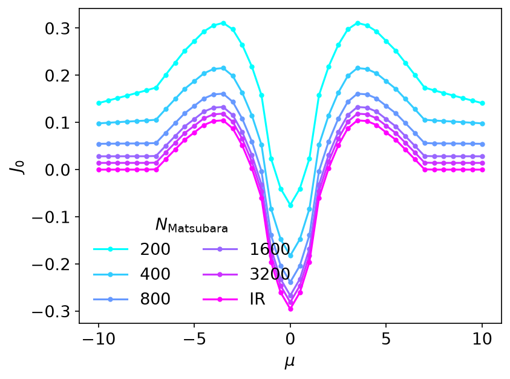
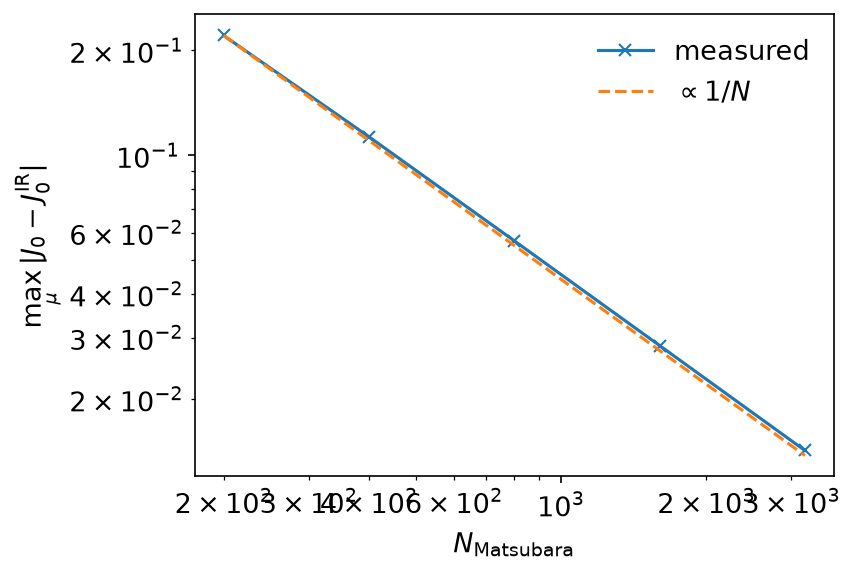
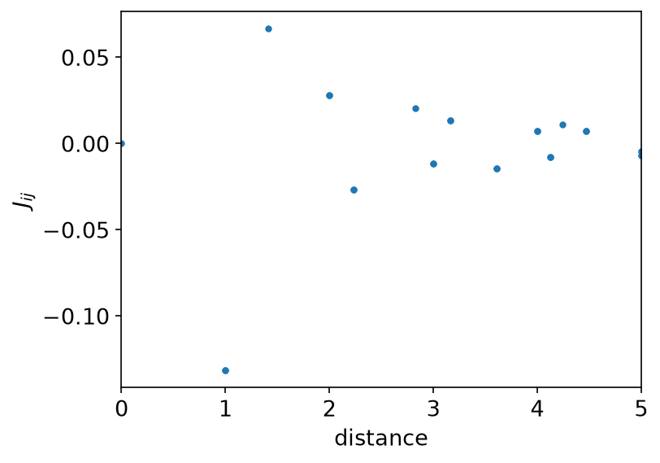

# Exchange interactions

*Ported from the Python notebook
[`liechtenstein_py.ipynb`](https://spm-lab.github.io/sparse-ir-tutorial-v2/src/liechtenstein_py.html)
of [sparse-ir-tutorial-v2](https://spm-lab.github.io/sparse-ir-tutorial-v2/),
whose author is Takuya Nomoto. The program that produced every number and
figure on this page is `docs/tutorial-code/src/bin/liechtenstein.rs`; the code
below is included from it.*

Both previous applied pages used the basis to hold a function of imaginary
time. This one uses it for something narrower and, in its way, more striking:
to do a Matsubara sum in one evaluation.

## Theory

The Liechtenstein method reads the parameters of a classical spin model off an
itinerant one by requiring that the two have the same second derivative of the
total energy with respect to spin angles. For a single orbital,

\\[
H = -t \sum_{\langle i, j\rangle, s} c^\dagger_{is} c_{js}
  - \sum_i \sum_{ss'} c^\dagger_{is}
    (\boldsymbol{B}_i \cdot \boldsymbol{\sigma}_{ss'}) c_{is'},
\\]

expanded about the ferromagnetic state \\(\boldsymbol{B}_i = B\hat{z}\\), the
requirement gives

\\[
J_{ij} = -B^2 T \sum_\nu G_{ij,+}(\mathrm{i}\nu) G_{ji,-}(\mathrm{i}\nu),
\\]

and, for the quantity that sets the mean-field transition temperature
\\(T_c^\mathrm{mf} = 2J_0/3\\),

\\[
J_0 = \frac{B}{2}(n_{0,+} - n_{0,-})
    + B^2 T \sum_\nu G_{00,+}(\mathrm{i}\nu) G_{00,-}(\mathrm{i}\nu).
\\]

Here \\(G_{ij,\pm}\\) is the Green's function of spin \\(\pm\\) in the field,
and \\(\nu = \nu_n = n\pi/\beta\\) runs over all fermionic frequencies
(\\(n\\) odd). Both are Matsubara sums of a *product* of two Green's
functions. That product falls off as \\(1/\nu^2\\), so a truncated sum converges like \\(1/N_M\\) —
slowly, and the more slowly the colder the system.

## Parameters

The example uses a square lattice with nearest-neighbour hopping
\\(t = 1\\) on a \\(36 \times 36\\) momentum grid, the field \\(B = 3\\),
\\(\beta = 50\\) and \\(\varepsilon = 10^{-7}\\). \\(J_0\\) is scanned over 41
chemical potentials from \\(\mu = -10\\) to \\(10\\); \\(J_{ij}\\) is computed at
half filling, \\(\mu = 0\\). The basis has to hold both spin-split bands, so
\\(\omega_\mathrm{max} = 2 \max(W, B) = 16\\) with the bandwidth \\(W = 8t\\),
and \\(\Lambda = \beta\omega_\mathrm{max} = 800\\).

```rust,ignore
{{#include ../../../tutorial-code/src/bin/liechtenstein.rs:parameters}}
```

## The sum as an evaluation

The way out is the elementary identity

\\[
T \sum_\nu F(\mathrm{i}\nu) = F(\tau = 0),
\\]

which turns the sum into one point of the imaginary-time function behind it.
A product of two Green's functions is as representable in the basis as a
single one, so the whole sum costs a fit and one evaluation:

```rust,ignore
{{#include ../../../tutorial-code/src/bin/liechtenstein.rs:u_at_zero}}
{{#include ../../../tutorial-code/src/bin/liechtenstein.rs:j0}}
```

`sampled` holds the product at the 38 sampling frequencies, one column per
chemical potential; `evaluate_rows` (a tutorial helper) contracts the
coefficients with \\(u_l(0)\\). At \\(\beta = 50\\) and \\(\Lambda = 800\\)
the basis has 37 functions. The size grows only like \\(\log \beta\\): since
\\(\Lambda = 16t\beta\\) here, \\(\beta = 500\\) gives 53 functions and
\\(\beta = 5000\\) gives 68, for a hundred times lower temperature.

The example also sums the series the naive way, on symmetric grids of 200 to
3200 frequencies (100 to 1600 on each side of zero), so that the two can be
put side by side:



The truncated sums are above the converged answer everywhere and creep down
towards it. How fast is the whole story:



Halving the error costs a doubling of the grid. Reaching the basis answer that
way would take of order \\(10^{9}\\) frequencies; the basis reaches it with
38.

The physics, once the answer is trusted: \\(J_0 < 0\\) at half filling, where
the system is an antiferromagnet by super-exchange, and \\(J_0 > 0\\) in the
low-carrier regime, where double exchange makes it a ferromagnet.

## \\(J_{ij}\\), and a check

\\(J_{ij}\\) needs the Green's function in real space rather than its zone
average, so a Fourier transform joins the sum. \\(G_{ij}\\) carries
\\(e^{-\mathrm{i}k\cdot r}\\) and \\(G_{ji}\\) carries
\\(e^{+\mathrm{i}k\cdot r}\\); since \\(\epsilon_{\boldsymbol{k}}\\) is even,
the second is the first applied to the same array. The program checks that
before relying on it:

```rust,ignore
{{#include ../../../tutorial-code/src/bin/liechtenstein.rs:even_dispersion}}
```

The on-site term \\(J_{00}\\) is not an exchange interaction, so it is set to
zero:

```rust,ignore
{{#include ../../../tutorial-code/src/bin/liechtenstein.rs:drop_onsite}}
```



The sum rule \\(J_0 = \sum_{j \ne 0} J_{0j}\\) then connects the two
calculations, which took different routes: one never left momentum space, the
other summed the 1295 off-site terms of the \\(36 \times 36\\) real-space
lattice. At \\(\mu = 0\\) they agree to \\(4 \times 10^{-8}\\)
(\\(J_0 \approx -0.2954590\\)), which is the accuracy of the basis
(\\(\varepsilon = 10^{-7}\\)) and not machine precision — as it should be.

## Going further

This page uses only the IR basis and stays on the imaginary axis. For
real-frequency output, see [MiniPole](minipole.md), which fits a few poles to
Matsubara data by ESPRIT, and [Analytic continuation](analytic_continuation.md)
for why that step is ill posed. [The DLR page](dlr.md) shows the pole-based
representation of imaginary-axis data.

## Running it

From `docs/tutorial-code`:

```console
$ cargo run --release --bin liechtenstein
```

The program writes CSV tables to `docs/tutorial-code/data/liechtenstein/`. The
figures are drawn from those tables; from the repository root, run
`uv run --project docs/plotting python docs/plotting/liechtenstein_plot.py`.

## Key API pieces

From `sparse-ir`:

| What you want | What to call |
| --- | --- |
| a Matsubara sum | fit (`MatsubaraSampling::fit_nd`), then evaluate at `τ = 0` |
| the row \\(u_l(0)\\) | `Basis::evaluate_tau(&[0.0])` |

From the tutorial crate (`sparse_ir_tutorial`, not part of the library):

| What you want | What to call |
| --- | --- |
| many chemical potentials at once | one column each; `IrMesh::wn_to_l` takes them together |
| contract \\(u_l(0)\\) with a block of coefficients | `evaluate_rows` |
| FFT from momentum to real space | `MomentumGrid::k_to_r` |
