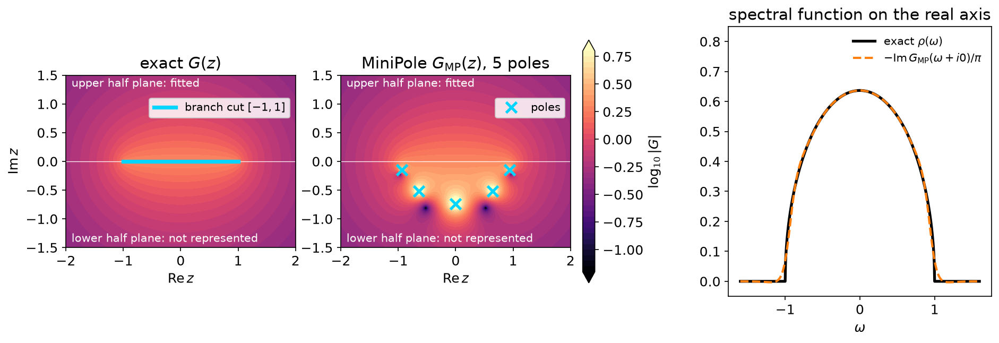
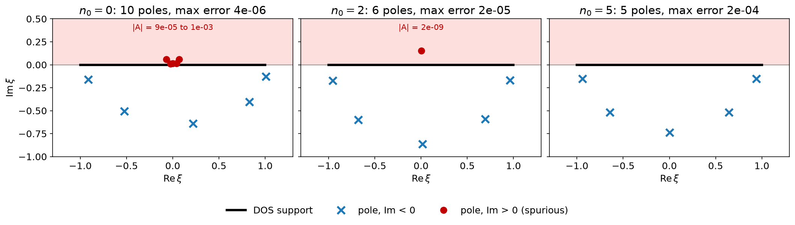

# MiniPole: a few complex poles from Matsubara data

`sparse_ir::minipole` is a Rust port of
[Green-Phys/MiniPole](https://github.com/Green-Phys/MiniPole) (MIT License),
the reference implementation of the minimal pole method: L. Zhang and E. Gull,
[Phys. Rev. B **110**, 035154 (2024)](https://doi.org/10.1103/PhysRevB.110.035154),
and, for matrix-valued functions, L. Zhang, Y. Yu and E. Gull,
[Phys. Rev. B **110**, 235131 (2024)](https://doi.org/10.1103/PhysRevB.110.235131).
Both rest on the ESPRIT algorithm, available on its own as `sparse_ir::esprit`.
The [Python tutorials](https://spm-lab.github.io/sparse-ir-tutorial-v2/) have
no MiniPole notebook; this page is written for the Rust library.

MiniPole approximates a Green's function by a small number of poles that are
allowed to leave the real axis,

\\[
    G(z) \simeq C + \sum_{j} \frac{A_j}{z-\xi_j}.
\\]

The [DLR](dlr.md) uses a fixed grid of real poles \\(\omega_p\\) that works
for every function with the same \\(\beta\\) and \\(\omega_{\max}\\). MiniPole
instead adapts the poles \\(\xi_j\\) to one particular function. The result is
much smaller than a DLR, it evaluates anywhere in the complex plane, and
\\(-\mathrm{Im}\\,G(\omega+\mathrm{i}0)/\pi\\) gives a spectral function, so it
doubles as a tool for [analytic continuation](analytic_continuation.md). A continuous spectrum is
represented by poles pushed below the real axis.

## What MiniPole gives you

Take the semicircular density of states
\\(\rho(\omega) = (2/\pi)\sqrt{1-\omega^2}\\) on \\([-1, 1]\\). Its Green's
function \\(G(z) = \int \mathrm{d}\omega\\,\rho(\omega)/(z-\omega)\\) is
\\(G(z) = 2\left(z - \sqrt{z-1}\sqrt{z+1}\right)\\) on the physical sheet.
With \\(\beta=100\\) and \\(\omega_{\max}=1.5\\), build a DLR, fit its
coefficients to the exact \\(G(\mathrm{i}\nu_n)\\) at the DLR's own sparse
Matsubara nodes, and compress the coefficients with MiniPole:

```rust
{{#include ../../../tutorial-code/src/bin/minipole.rs:imports}}
{{#include ../../../tutorial-code/src/bin/minipole.rs:semicircle_model}}
{{#include ../../../tutorial-code/src/bin/minipole.rs:semicircle}}
# Ok::<(), Box<dyn std::error::Error>>(())
```

The DLR has 39 poles. MiniPole returns five:
\\(\pm 0.940 - 0.151\mathrm{i}\\), \\(\pm 0.643 - 0.516\mathrm{i}\\) and
\\(-0.737\mathrm{i}\\). The code asserts that every pole lies in the lower half
plane and that \\(|G_{\rm MP}(\mathrm{i}\nu_n) - G(\mathrm{i}\nu_n)| < 10^{-3}\\)
for the positive fermionic frequencies \\(\nu_n = n\pi/\beta\\), \\(n\\) odd,
\\(n < 2000\\); the actual maximum is \\(1.8\times 10^{-4}\\).



Left: \\(\log_{10}|G(z)|\\) of the exact function, analytic everywhere except
on the branch cut \\([-1,1]\\). Middle: the MiniPole reconstruction. In the
upper half plane, where the Matsubara data live, the two panels agree. The
branch cut is replaced by five poles in the lower half plane; there,
\\(G_{\rm MP}\\) is not meant to reproduce \\(G\\). Right: the spectral
function \\(-\mathrm{Im}\\,G_{\rm MP}(\omega+\mathrm{i}0)/\pi\\) against the
exact semicircle. Since no pole is on or above the real axis,
\\(G_{\rm MP}(\omega+\mathrm{i}0)\\) is simply \\(G_{\rm MP}(\omega)\\).

The number of poles is controlled by the ESPRIT tolerance `err`
(\\(\varepsilon\\) in the [conventions](../getting-started/conventions.md)).
It grows slowly as `err` decreases:

```rust,ignore
{{#include ../../../tutorial-code/src/bin/minipole.rs:err_scan}}
```

| `err` | poles | max \\(\lvert G_{\rm MP}-G\rvert\\) on \\(\mathrm{i}\nu_n\\) |
|---|---|---|
| \\(10^{-4}\\) | 3 | \\(7.4\times 10^{-3}\\) |
| \\(10^{-6}\\) | 4 | \\(1.2\times 10^{-3}\\) |
| \\(10^{-8}\\) | 5 | \\(1.8\times 10^{-4}\\) |
| \\(10^{-10}\\) | 6 | \\(3.0\times 10^{-5}\\) |

`err` is a tolerance for the singular values inside ESPRIT. It is **not** a
bound on the error of \\(G\\): with `err = 1e-8` the Matsubara error is
\\(1.8\times 10^{-4}\\).

## Three entry points

| Function | Input | Frequencies | `n0` means | Upper end of the contour |
|---|---|---|---|---|
| `mini_pole_dlr_from(&dlr, &coeffs, &p)` | DLR coefficients \\(g_l\\) from `MatsubaraSampling::fit_nd` | contour \\(\omega_n = (2n+1)\pi/\beta\\), **also for bosons** | contour index | `nmax` (default \\(\beta\\)) |
| `mini_pole_dlr(&residues, &locations, beta, &p)` | real poles and their actual residues | same as above | contour index | `nmax` |
| `mini_pole(&values, &freqs, &p)` | \\(G\\) on a uniform, non-negative grid of physical frequencies \\(\omega_n\\) (real numbers, not indices) | as supplied | position in the array (`N0::Auto` by default) | last element |
| C API `spir_minipole_from_matsubara` | as `mini_pole` | reduced indices \\(n\\), converted as \\(\omega = n\pi/\beta\\) | position in the array (\\(<0\\): automatic) | last element |

`p` is `MiniPoleDlrParams` for the first two and `MiniPoleParams` for
`mini_pole`. `mini_pole_dlr_from` forms the residues \\(A_l = g_l w_l\\) with
`dlr.pole_weights()` itself; bosonic DLR coefficients are not residues, so do
not pass them to `mini_pole_dlr`. The contour index of the DLR entry points is
*not* the reduced Matsubara index \\(n\\) used elsewhere in the library
(\\(\mathrm{i}\nu_n = \mathrm{i}n\pi/\beta\\)). The C function
`spir_minipole_from_dlr` follows `mini_pole_dlr_from`.

All of them return a `MiniPoleResult` with `pole_location` (\\(\xi_j\\), sorted
by real part), `pole_weight` (\\(A_j\\)), `constant` (\\(C\\)), and
`evaluate(&z)` for arbitrary complex \\(z\\). The full list of parameters
(symmetry, fixed pole count, `N0::Auto`, constant term, residue plane, C
arguments) is in the
[`sparse_ir::minipole` module documentation](https://spm-lab.github.io/sparse-ir-rs/api/sparse_ir_minipole/minipole/index.html).

## Choosing the contour and `err`

MiniPole does not work on the Matsubara values directly. It maps the complex
plane, cut along a segment of the imaginary axis, conformally onto the unit
disk, so that the segment becomes the unit circle. It then computes moments of
\\(G\\) along the segment and runs ESPRIT on those moments. For the DLR entry points the segment is

\\[
    [\mathrm{i}\omega_{n_0},\\ \mathrm{i}\omega_{n_{\max}}],\qquad
    \omega_n=(2n+1)\pi/\beta .
\\]

- `n0` sets the lower end. There is no automatic choice for DLR input.
- `nmax` sets the upper end; `None` means \\(n_{\max}=\beta\\) (the number, in
  the units of the input). It is a floating-point cutoff, not a number of
  samples, and must exceed `n0`.
- `err` is the ESPRIT tolerance described above: set it at or above the noise
  level of the data.

The contour matters. Keep the same DLR coefficients and `err = 1e-8`, and
start the contour at three different points:

```rust,ignore
{{#include ../../../tutorial-code/src/bin/minipole.rs:n0_scan}}
```



For `n0 = 0` and `n0 = 2` MiniPole returns extra poles in the **upper** half
plane, near the origin. Their weights are tiny (\\(10^{-4}\\) to
\\(10^{-3}\\) and \\(2\times 10^{-9}\\)), and the Matsubara error is in fact
*smaller* than for `n0 = 5` (\\(4\times10^{-6}\\) and \\(2\times10^{-5}\\)
against \\(2\times10^{-4}\\)). But a pole with \\(\mathrm{Im}\\,\xi>0\\) makes
\\(G_{\rm MP}\\) non-analytic in the upper half plane, so it cannot be a
retarded Green's function. With `n0 = 5` all poles are in the lower half plane.
The lesson: a small residual on the Matsubara axis does not validate the
contour; **a pole in the upper half plane is the sign of a bad contour.**

## A harder case: a low-energy bosonic pair

Now take a bosonic susceptibility with \\(\beta=20\\), \\(\omega_{\max}=3\\),
and the odd spectral function

\\[
    \rho(\omega)=\sum_j A_j\delta(\omega-\xi_j),\qquad
    (\xi_j,A_j)=(-1.2,-0.2),(-0.1,-0.3),(0.1,0.3),(1.2,0.2).
\\]

Thus \\(\rho(-\omega)=-\rho(\omega)\\), the inner pair has
\\(\beta|\xi|=2\\), and \\(\chi(0)=-19/3\\) is finite. Fit the exact
\\(\chi(z)=\sum_j A_j/(z-\xi_j)\\) at the DLR's sparse Matsubara nodes and
compress the coefficients. The DLR contour uses \\((2n+1)\pi/\beta\\) here
too, even though the data are bosonic:

```rust
{{#include ../../../tutorial-code/src/bin/minipole.rs:imports}}
{{#include ../../../tutorial-code/src/bin/minipole.rs:dlr}}
# Ok::<(), Box<dyn std::error::Error>>(())
```


With `n0 = 5`, `err = 1e-8` and the default `nmax = beta = 20`, MiniPole
returns three poles: the low-energy pair is merged into a single pole near
\\(0.380\mathrm{i}\\), again in the upper half plane. Extending the contour to
`nmax = 50` gives four poles that match the exact ones to \\(10^{-3}\\), and
\\(\chi_{\rm MP}(0)\\) within 1 %. The left panel shows the inner poles (the
outer pair at \\(\pm1.2\\) is not shown); the right panel shows the error at
the bosonic frequencies \\(\nu_m = 2m\pi/\beta\\), including \\(m=0\\),
normalized by \\(|\chi(0)|\\).


Each cell uses the same DLR coefficients and `err = 1e-8`. The number is
\\(\max_{0\le m\le200}|\chi_{\rm MP}(\mathrm{i}\nu_m)-\chi(\mathrm{i}\nu_m)|/|\chi(0)|\\)
and the second line the pole count; lighter cells are better. The dashed box
is the default contour, the solid box the one used above. Only `n0 = 5` with
`nmax = 50` or `100` brings the error below \\(10^{-2}\\). A longer contour is not a universal
cure, and neither `n0 = 5` nor `nmax = 50` is a general recommendation.

## Practical checklist

- Compare a few contours (`n0`, `nmax`) on the same data rather than trusting
  one.
- Reject any result with a pole in the upper half plane.
- Check that the poles and residues are stable when the contour or `err`
  changes slightly.
- Check the reconstruction at frequencies not used in the fit, especially
  near zero frequency.
- With noisy data, set `err` at or above the noise level instead of asking for
  ever more poles.

A good fit at high Matsubara frequencies does not prove that a low-energy
feature or the static response is right, and fitting imaginary frequencies
does not guarantee a unique real-axis continuation for noisy data. The
examples here have an exact answer to compare with; for measured data,
stability and held-out residuals are diagnostics, not proof that the poles are
physical.

## Reproduce the figures

From `docs/tutorial-code`:

```bash
cargo run --profile ci --bin minipole
uv run --project ../plotting python ../plotting/minipole_plot.py
```

The binary writes CSV tables under `docs/tutorial-code/data/minipole/`; the
plotting script only reads them.
