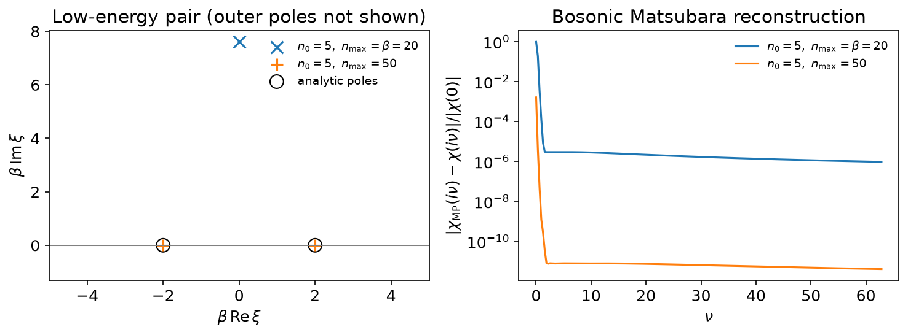
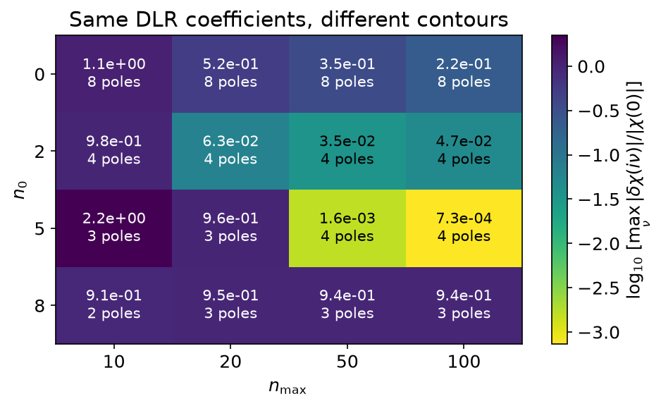

# MiniPole: choosing the contour

The discrete Lehmann representation (DLR) fixes a reusable real-frequency pole
grid. MiniPole instead extracts a small set of poles for a particular function,

\\[
    G(z) \simeq C + \sum_j \frac{A_j}{z-\xi_j}.
\\]

Here we start from DLR coefficients and compress an analytic bosonic
susceptibility. The executable source is
`docs/tutorial-code/src/bin/minipole.rs`; the code below is included directly
from it. This uses `sparse_ir::minipole`, whose module documentation records
the port's provenance and differences from the reference implementation.

## DLR coefficients are not residues

`mini_pole_dlr_from(&dlr, &coeffs, &params)` accepts the same coefficients
that `MatsubaraSampling::fit_nd` returns for that DLR. Internally it forms
residues \\(A_l=g_l w_l\\) using `dlr.pole_weights()`. In particular, bosonic
DLR coefficients must not be passed as bare residues.

If you already have real poles and their actual residues, use
`mini_pole_dlr(&residues, &locations, beta, &params)` instead. The tensor's
first axis is the pole axis; trailing axes are channels, in column-major
order. The result contains complex pole locations and residues, and
`evaluate(&z)` evaluates their sum plus the constant term.

## A low-energy bosonic pair

Take \\(\beta=20\\), \\(\omega_{\max}=3\\), and the odd spectral function

\\[
    \rho(\omega)=\sum_j A_j\delta(\omega-\xi_j),\qquad
    (\xi_j,A_j)=(-1.2,-0.2),(-0.1,-0.3),(0.1,0.3),(1.2,0.2).
\\]

Thus \\(\rho(-\omega)=-\rho(\omega)\\), the inner pair has
\\(\beta|\xi|=2\\), and \\(\chi(0)=-19/3\\) is finite. Fit exact values of
\\(\chi(z)=\sum_j A_j/(z-\xi_j)\\) at the DLR's sparse Matsubara nodes,
then ask MiniPole to compress the coefficients:

```rust
{{#include ../../../tutorial-code/src/bin/minipole.rs:imports}}
{{#include ../../../tutorial-code/src/bin/minipole.rs:dlr}}
# Ok::<(), Box<dyn std::error::Error>>(())
```

The pole and residue bounds here are \\(10^{-3}\\); the static relative-error
bound is \\(10^{-2}\\), matching the low-energy regression test. These are
checks for this model, not an accuracy guarantee derived from `err=1e-8`.



Holding `n0=5` and `err=1e-8` fixed, the default `nmax=beta=20` yields three
poles: the low-energy pair is replaced by a complex pole near
`0 + 0.380i`, not resolved as two distinct real poles. Extending
the contour to `nmax=50` yields four poles and resolves that pair. The left
panel shows the inner poles in the complex plane; the outer poles are not
shown. The right panel checks the complex reconstruction error at bosonic
frequencies
\\(\nu_m=2m\pi/\beta\\), including \\(m=0\\), normalized by \\(|\chi(0)|\\).

A good fit at high Matsubara frequencies alone does not prove that a
low-energy pair or the static response is accurate. Nor does fitting imaginary
frequencies guarantee a unique or stable real-axis continuation for noisy data.

## What `n0` and `nmax` mean

For the **DLR-input path with `symmetry=false`**, the conformal map uses the
imaginary-axis segment

\\[
    [\mathrm{i}\omega_{n_0},\mathrm{i}\omega_{n_{\max}}],\qquad
    \omega_n=(2n+1)\pi/\beta.
\\]

- `n0` is a non-negative integer, specified by the caller. There is no
  automatic choice for DLR input. Increasing it raises the lower endpoint.
- `nmax: None` uses the numerical value of `beta` in the units of the input.
  An explicit `Some(nmax)` must exceed `n0`; it is a floating-point contour
  cutoff, not a number of input samples.
- This contour convention uses **`(2n+1)pi/beta` even for a bosonic DLR**.
  It is not the physical bosonic sampling grid and is not the C API's reduced
  Matsubara index `n`, for which the frequency is `n*pi/beta`.
- With `symmetry=true`, the gapless map uses the lower endpoint instead;
  `nmax` does not control that map. The comparison on this page keeps
  `symmetry=false`.

Changing the segment changes the mapped poles and moments seen by ESPRIT,
so the same coefficients and tolerance need not yield the same number of poles.
`err_type=Abs` (the default) sets an absolute ESPRIT tolerance;
`ErrType::Rel` scales it by the largest singular value. It is **not** a bound
on the reconstruction error of \\(G\\). You may instead set `m=Some(count)`
with `err=None` when the model order is known. Automatic knee detection when
both are absent is not implemented.



Every cell uses the same fitted DLR coefficients, `eps=1e-12`, `err=1e-8`,
and `symmetry=false`. The number is
\\(\max_{0\le m\le200}|\chi_{\rm MP}(\mathrm{i}\nu_m)-\chi(\mathrm{i}\nu_m)|/|\chi(0)|\\);
the second line is the extracted pole count. A longer contour is not a universal
cure, and neither `n0=5` nor `nmax=50` is a general recommendation.

In practice, compare a small set of contours, inspect pole/residue stability,
and check reconstruction at frequencies not used for fitting, especially near
zero. If noise is present, set the tolerance to reflect that noise rather than
trying to extract ever more poles. This analytic example has an oracle;
for measured data, stability and held-out residuals are diagnostics, not a
proof that recovered poles are physical.

## Direct Matsubara input is different

`mini_pole(&values, &frequencies, &MiniPoleParams::new(err))` takes **real
physical frequencies** \\(\omega\\), not integer indices or complex
\\(\mathrm{i}\omega\\). Supply at least three finite, non-negative,
strictly increasing, uniformly spaced frequencies, with data of shape
`[n_w]` or `[n_w, n_orb, n_orb]`. Sparse DLR/IR sampling nodes, irregular grids,
and negative-frequency input sets are not supported by this entry point.
The DLR fitting step above can use negative and sparse nodes; it is not a
call to `mini_pole`.

For this path, `n0` is a **position in the supplied array**: the contour starts
at `frequencies[n0]` and ends at its last element without symmetry. There is
no `nmax` parameter; extend the supplied data if you need a larger upper
endpoint. The default is `N0::Auto { shift: 0 }`; inspect the resulting `n0`,
and compare with `N0::Fixed(...)` if needed. `err` is required and should be
at least the noise level. `err_max` reports the first ESPRIT interpolation's
precision, **not** a certified total reconstruction error. It is `None` for
DLR input. With symmetry, `frequencies[n0]` must be positive, so a bosonic
zero-frequency point cannot be the lower endpoint of the gapless map.

`g_symmetric` symmetrizes matrix data as `G_ij=G_ji`, separately from the
up-down `symmetry` flag. `compute_const=true` fits a constant term and cannot
be combined with `symmetry=true`. Residues default to a least-squares fit
in `Plane::Z` without symmetry, or the mapped `Plane::W` with symmetry;
`include_n0=true` also includes the initially excluded points in the
z-plane residue fit.

At the C boundary, `spir_minipole_from_matsubara` instead accepts reduced
integer indices (`1,3,5,...` for fermions; `0,2,4,...` for bosons), converted
as `omega=n*pi/beta`. A negative `n0` selects automatic choice and
`n0_shift` adds an offset. For `spir_minipole_from_dlr`, `nmax<=0` selects
`beta`. Getters expose the constant, chosen `n0`, and Matsubara-only
`err_max`; there is no DLR-fit-residual getter.

## Reproduce the figures

From the repository root:

```bash
cargo run --manifest-path docs/tutorial-code/Cargo.toml --profile ci --locked --bin minipole
uv run --project docs/plotting python docs/plotting/minipole_plot.py
```

The Rust binary checks the four poles against the analytic model and writes
CSV tables under `docs/tutorial-code/data/minipole/`. The plotter only reads
those tables. CI runs the binary through `tutorial_binaries`, and mdBook
compiles and executes the included example.
