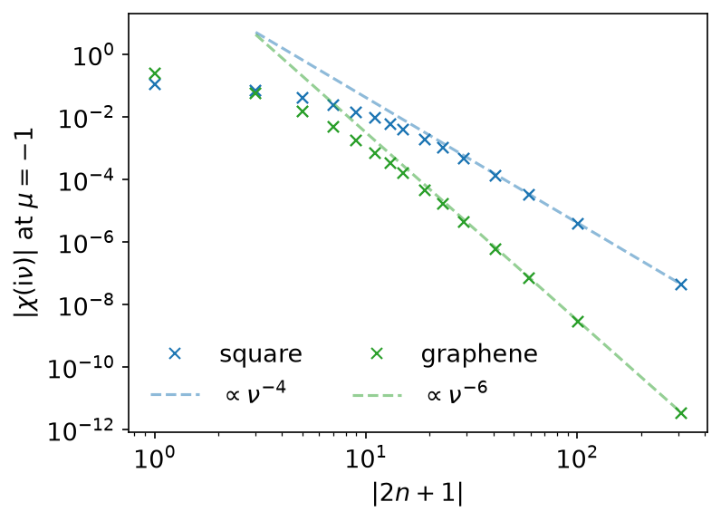
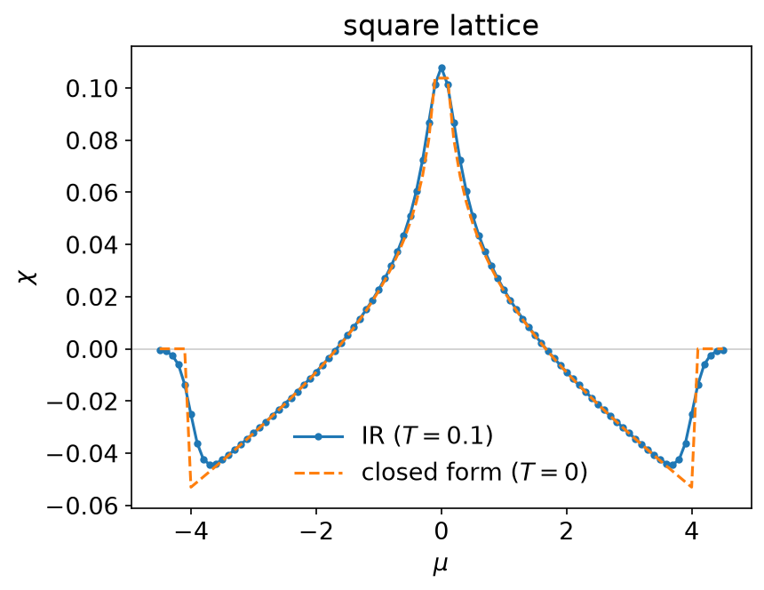
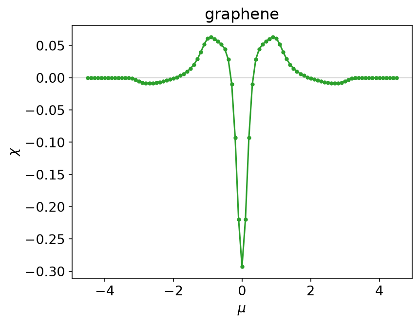

# Orbital magnetic susceptibility

*Ported from the Python notebook
[`orbital_magnetic_susceptibility_py.ipynb`](https://spm-lab.github.io/sparse-ir-tutorial-v2/src/orbital_magnetic_susceptibility_py.html)
of [sparse-ir-tutorial-v2](https://spm-lab.github.io/sparse-ir-tutorial-v2/),
whose authors are Soshun Ozaki and Takashi Koretsune. The program that
produced every number and figure on this page is
`docs/tutorial-code/src/bin/orbital_magnetic_susceptibility.rs`; the code below
is included from it.*

The previous page used the basis to turn a Matsubara sum into one evaluation.
This one does the same thing for a harder summand, and adds the other piece
every multi-orbital calculation needs: a Hamiltonian that is a matrix at each
momentum.

## Theory

Orbital magnetism is what a vector potential coupled to the electron momentum
induces. For a tight-binding model the susceptibility has a closed form in
terms of the Green's function and the derivatives of the Hamiltonian,

\\[
\chi = T \sum_\nu \chi(\mathrm{i}\nu), \qquad
\chi(\mathrm{i}\nu) = \frac{1}{N_k}\sum_{\boldsymbol{k}} \mathrm{Tr}\left[
  \gamma_x G \gamma_y G \gamma_x G \gamma_y G
  + \tfrac{1}{2}(\gamma_x G \gamma_y G + \gamma_y G \gamma_x G)\gamma_{xy} G
\right],
\\]

with \\(G = G(\mathrm{i}\nu, \boldsymbol{k})\\),
\\(\gamma_i = \partial H_{\boldsymbol{k}} / \partial k_i\\),
\\(\gamma_{xy} = \partial^2 H_{\boldsymbol{k}} / \partial k_x \partial k_y\\),
and \\(\nu = \nu_n = n\pi/\beta\\) running over the fermionic frequencies
(\\(n\\) odd). The momentum sum is an average over the \\(N_k\\) points of the
zone, so \\(\chi\\) is per unit cell. Units are \\(e = \hbar = k_B = 1\\)
with \\(t = a = 1\\): the prefactor \\(e^2/\hbar^2\\) of the notebook's formula
is dropped. No spin factor is included, so \\(\chi\\) is for one spin species;
multiply by 2 for spin-degenerate electrons.
The formula is due to Gómez-Santos and Stauber, and to Raoux, Piéchon, Fuchs
and Montambaux; its relation to Fukuyama's continuum formula was settled by
Ogata and Fukuyama and by Matsuura and Ogata.

The example computes it at \\(T = 0.1\\) (\\(\beta = 10\\)) on a
\\(200 \times 200\\) momentum grid, for 91 chemical potentials from
\\(\mu = -4.5\\) to \\(4.5\\). The basis uses \\(\omega_\mathrm{max} = 10\\)
(\\(\Lambda = 100\\)) and \\(\varepsilon = 10^{-10}\\), which gives 30 functions:

```rust,ignore
{{#include ../../../tutorial-code/src/bin/orbital_magnetic_susceptibility.rs:parameters}}
```

It is written entirely in Matsubara sums of products of Green's functions,
which is what makes it a good example. Here the summand is a product of three
or four of them, not two:



The square lattice falls off as \\(\nu^{-4}\\) — a dispersion that separates
has no \\(\gamma_{xy}\\), so the three-Green's-function term is absent
entirely — and graphene, whose velocity matrices are purely off-diagonal in
the site basis, as \\(\nu^{-6}\\). Thirty sampling frequencies hold all of it,
and the sum is again

```rust,ignore
{{#include ../../../tutorial-code/src/bin/orbital_magnetic_susceptibility.rs:u_at_zero}}
{{#include ../../../tutorial-code/src/bin/orbital_magnetic_susceptibility.rs:matsubara_sum}}
```

with one column per chemical potential; there are 91 of them, fitted in one
call.

## Square lattice

One band makes every matrix in the formula a number and the trace a product,
so the whole summand is two terms:

```rust,ignore
{{#include ../../../tutorial-code/src/bin/orbital_magnetic_susceptibility.rs:square_summand}}
```

After the loop over momenta, the sum is divided by \\(N_k\\):

```rust,ignore
{{#include ../../../tutorial-code/src/bin/orbital_magnetic_susceptibility.rs:zone_average}}
```

\\(\gamma_{xy}\\) is identically zero here, and the second term with it; the
example keeps it so that the code is the formula rather than a special case
of it.



At \\(T = 0\\) the same quantity is known in closed form,

\\[
\chi = -\frac{2}{3\pi^2}\left[E(m) - \frac{K(m)}{2}\right],
\qquad m = 1 - \frac{\mu^2}{16},
\\]

zero outside the band. `sparse_ir_tutorial::elliptic` computes \\(K\\) and
\\(E\\) from the arithmetic-geometric mean, which is a dozen lines and needs
no dependency. The two curves lie on top of each other to better than
\\(10^{-3}\\) for \\(1 \le |\mu| \le 3\\), and part company only where they
must: at the van Hove filling \\(\mu = 0\\), where the closed form diverges and
\\(T = 0.1\\) does not, and at the band edge, where the Fermi function rounds
the step off. Because of the divergence, the program leaves \\(\mu = 0\\) out of
the closed-form table.

## Graphene

Two sites per cell make \\(H_{\boldsymbol{k}}\\) a 2×2 matrix, which has to be
diagonalised before the Green's function can be written down. In the
eigenbasis \\(G\\) is diagonal, so the trace of four matrices becomes a
product of 2×2 matrices whose columns are scaled by \\(G\\):

```rust,ignore
{{#include ../../../tutorial-code/src/bin/orbital_magnetic_susceptibility.rs:graphene_summand}}
```

`Hermitian2` in `sparse_ir_tutorial::linalg` solves the 2×2 eigenproblem in
closed form rather than calling a general routine, because a general routine
is free to return the eigenvectors with any phase and the tutorial's numbers
have to be reproducible. The susceptibility does not care about the phase:
it is a trace of rotated matrices.



The result is the opposite of the square lattice: a sharp *diamagnetic* peak
at the Dirac point, the delta function of the massless spectrum rounded by
temperature, paramagnetic shoulders on either side, and nothing at all outside
the band, which spans \\(|\epsilon| \le 3t\\).

## Going further

This page uses only the IR basis and stays on the imaginary axis. For
real-frequency output, see [MiniPole](minipole.md), which fits a few poles to
Matsubara data by ESPRIT, and [Analytic continuation](analytic_continuation.md)
for why that step is ill posed. [The DLR page](dlr.md) shows the pole-based
representation of imaginary-axis data.

## Running it

From `docs/tutorial-code`:

```console
$ cargo run --release --bin orbital_magnetic_susceptibility
```

The program writes CSV tables to
`docs/tutorial-code/data/orbital_magnetic_susceptibility/`. The figures are
drawn from those tables; from the repository root, run
`uv run --project docs/plotting python docs/plotting/orbital_magnetic_susceptibility_plot.py`.
The Python counterpart of this program,
`docs/tutorial-code/scripts/reference_orbital_magnetic_susceptibility.py`,
diagonalises with numpy's `eigh`, which picks other eigenvector phases; the
susceptibilities of the two agree to about
\\(2 \times 10^{-14}\\).

## Key API pieces

From `sparse-ir`:

| What you want | What to call |
| --- | --- |
| a Matsubara sum | fit (`MatsubaraSampling::fit_nd`), then evaluate at `τ = 0` |
| the row \\(u_l(0)\\) | `Basis::evaluate_tau(&[0.0])` |

From the tutorial crate (`sparse_ir_tutorial`, not part of the library):

| What you want | What to call |
| --- | --- |
| many chemical potentials at once | one column each; `IrMesh::wn_to_l` takes them together |
| contract \\(u_l(0)\\) with a block of coefficients | `evaluate_rows` |
| a 2×2 Hermitian eigenproblem | `Hermitian2::eigen`, `Hermitian2::rotate` |
| \\(K(m)\\), \\(E(m)\\) | `elliptic::ellipk`, `elliptic::ellipe` |
