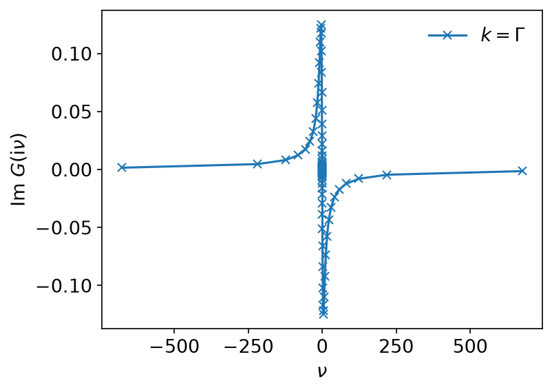
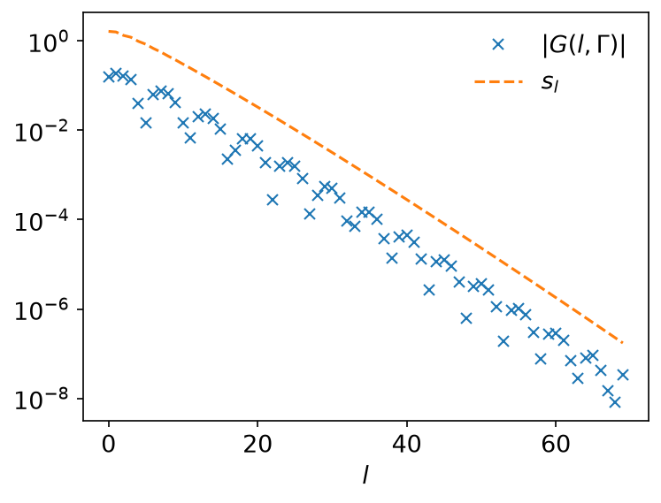
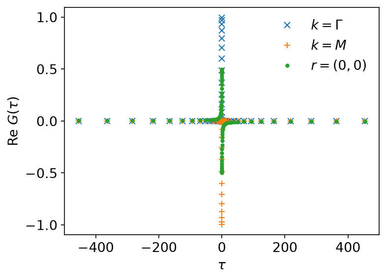
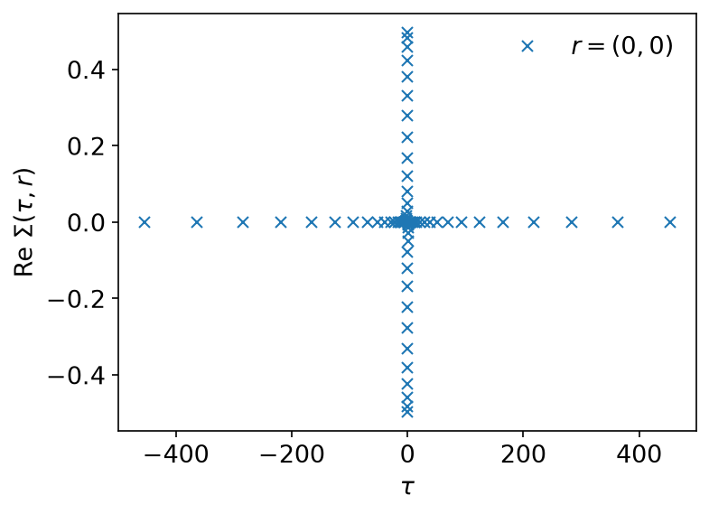
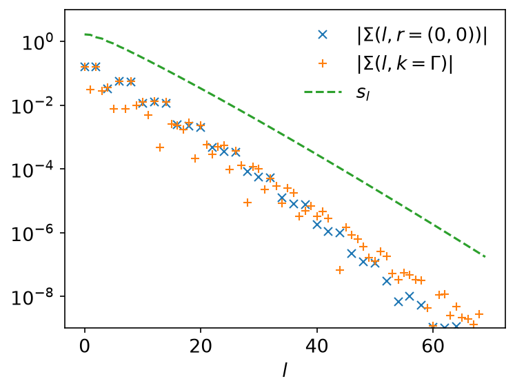
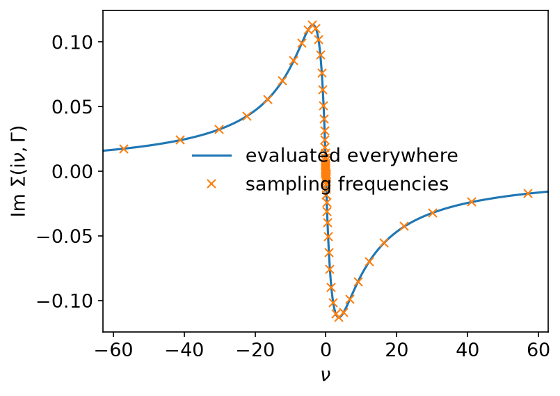

# Second-order perturbation

*Ported from the Python notebook `second_order_perturbation_py.ipynb` of
sparse-ir-tutorial. The program that produced every number and figure on this
page is `docs/tutorial-code/src/bin/second_order_perturbation.rs`.*

This is the first page where the basis earns its keep on a real problem: the
second-order self-energy of the Hubbard model on a square lattice, on a
256 × 256 momentum grid at \\(\beta = 10^3\\). Nothing here is ever stored on a
dense imaginary-time or Matsubara grid — 70 basis functions carry the whole
frequency dependence.

## Theory

The Hubbard model at half filling,

\\[
\mathcal{H} = -t \sum_{\langle i, j\rangle} c^\dagger_{i\sigma} c_{j\sigma}
  + U \sum_i n_{i\uparrow} n_{i\downarrow}
  - \mu \sum_i (n_{i\uparrow} + n_{i\downarrow}),
\\]

with \\(t = 1\\) and \\(\mu = U/2\\), has the non-interacting dispersion

\\[
\epsilon(\boldsymbol{k}) = -2(\cos k_x + \cos k_y)
\\]

and the non-interacting Green's function

\\[
G(\mathrm{i}\nu, \boldsymbol{k}) =
  \frac{1}{\mathrm{i}\nu - \epsilon(\boldsymbol{k}) + \mu}.
\\]

The first-order (Hartree) term of the self-energy is absorbed into the
chemical potential, so at half filling \\(\mu = 0\\) and the dispersion is used
as it stands. The second-order term is a product in imaginary time and real
space:

\\[
\Sigma(\tau, \boldsymbol{r}) =
  U^2 G^2(\tau, \boldsymbol{r})\, G(\beta - \tau, \boldsymbol{r}).
\\]

That single line is the reason the calculation moves between representations.
\\(G\\) is a formula on the Matsubara axis; the self-energy is a product only in
\\((\tau, \boldsymbol{r})\\); and the answer is wanted back on the Matsubara
axis. Each hop is one fit and one evaluation.

Momentum and real space are connected by

\\[
A(\mathrm{i}\nu, \boldsymbol{r}) = \frac{1}{N} \sum_{\boldsymbol{k}}
  e^{-\mathrm{i}\boldsymbol{k}\cdot\boldsymbol{r}} A(\mathrm{i}\nu, \boldsymbol{k}),
\qquad
A(\mathrm{i}\nu, \boldsymbol{k}) = \sum_{\boldsymbol{r}}
  e^{\mathrm{i}\boldsymbol{k}\cdot\boldsymbol{r}} A(\mathrm{i}\nu, \boldsymbol{r}),
\\]

with \\(N = N_\mathrm{lin}^2\\) points on each of the two regular grids. Both
are FFTs, which is what makes 65536 momenta affordable.

## The basis and the sampling points

\\(\Lambda = 10^5\\), \\(\beta = 10^3\\) and \\(\varepsilon = 10^{-7}\\) give a
basis of 70 functions.

```rust
use sparse_ir::{Fermionic, FiniteTempBasis, LogisticKernel};

let beta = 1e3;
let wmax = 1e5 / beta;
let kernel = LogisticKernel::new(beta * wmax)?;
let basis = FiniteTempBasis::<LogisticKernel, Fermionic>::new(kernel, beta, Some(1e-7), None)?;

assert_eq!(basis.size(), 70);
# Ok::<(), sparse_ir::Error>(())
```

The condition numbers of the two samplings are about 163 and 466, so a fit
loses two to three significant digits: with \\(\varepsilon = 10^{-7}\\) the
results are good to four or five. Asking for a smaller \\(\varepsilon\\) buys
more of them, at the price of a larger basis.

The example wraps the two samplings in an `IrMesh`, a small helper of the
tutorial crate that holds a `TauSampling` and a `MatsubaraSampling` for one
basis and moves a whole array of Green's functions between them:

```rust,ignore
use sparse_ir_tutorial::{IrMesh, MomentumGrid};

let mesh = IrMesh::<Fermionic>::new(&basis)?;
let grid = MomentumGrid::new(256, 256);
let nk = grid.len();
```

Arrays are stored row-major as `(frequency or time, momentum)`, so `nk` is the
column count every transform is told about.

## From the Matsubara axis to \\((\tau, \boldsymbol{r})\\)

\\(G_0\\) is written down frequency by frequency,

```rust,ignore
let ek = grid.square_lattice_dispersion(1.0);
let mut gkf = Vec::with_capacity(mesh.n_wn() * nk);
for &nu in &nu {
    for &e in &ek {
        gkf.push(Complex64::new(-e, nu).inv());
    }
}
```

and then fitted to the basis and evaluated at the sampling times:

```rust,ignore
let gkl = mesh.wn_to_l(&gkf, nk)?;   // values → coefficients
let gkt = mesh.l_to_tau(&gkl, nk)?;  // coefficients → values
let grt = grid.k_to_r(&gkt);         // and into real space
```



The coefficients fall off like the singular values, which is the statement
that the basis is the right one for this function:





Note where the sampling times lie: on \\([-\beta/2, \beta/2]\\), not on
\\([0, \beta)\\) as in the Python notebook. The two are the same set of points
seen through \\(G(\tau - \beta) = -G(\tau)\\); see
[Conventions](../getting-started/conventions.md).

## The self-energy

\\(G(\beta - \tau)\\) is where that convention has to be handled rather than
just noted. On \\([0, \beta)\\) it is the reversed array, which is what the
notebook writes as `grt[::-1]`. On the symmetric grid the reversed array is
\\(G(-\tau)\\), and

\\[
G(\beta - \tau) = \zeta\, G(-\tau),
\qquad \zeta = -1 \text{ (fermionic)},\ +1 \text{ (bosonic)},
\\]

so the sign has to come along. `IrMesh::reverse_tau` is exactly that
operation, and it is the only place in the applied tutorials where the
relation appears. It does not assume the grid is closed under
\(\tau \to -\tau\): a sampling time may sit at exactly \(\beta/2\), whose
mirror is the same point one period away, and the extra \(\zeta\) from that
period is applied where it is needed (see [GW](gw.md), whose grid has such a
point):

```rust,ignore
let reversed = mesh.reverse_tau(&grt, nk);
let srt: Vec<Complex64> = grt
    .iter()
    .zip(&reversed)
    .map(|(g, g_reversed)| U * U * g * g * g_reversed)
    .collect();
```



Getting the sign wrong, or reversing without it, changes \\(\Sigma\\) by a
factor of order one — a picture that still looks plausible. That is why the
relation is pinned by its own test
(`docs/tutorial-code/tests/tau_convention.rs`) against a direct evaluation of
\\(u_l(\beta - \tau)\\), rather than trusted to a reading of the convention.

## Back to the Matsubara axis

The way back is the way in, in reverse:

```rust,ignore
let srl = mesh.tau_to_l(&srt, nk)?;   // values → coefficients
let skl = grid.r_to_k(&srl);          // and back to momentum
let sigma_iv = mesh.l_to_wn(&skl, nk)?;
```



The coefficients of \\(\Sigma\\) decay like those of \\(G\\), which says the
product of three Green's functions is still a function the basis represents
well — the fact the whole method rests on.

Because the answer is a set of coefficients, \\(\Sigma\\) can be evaluated on
any frequencies at all, not only on the ones that were sampled. Here on every
tenth fermionic frequency out to \\(|n| = 20000\\):

```rust,ignore
let freqs: Vec<FermionicFreq> = (-10000..10000)
    .step_by(20)
    .map(|n| FermionicFreq::new(2 * n + 1))
    .collect::<Result<_, _>>()?;
let sampling = MatsubaraSampling::<Fermionic>::with_sampling_points(&basis, freqs)?;
let sigma_far = sampling.evaluate(&skl_gamma)?;
```



The sampled points lie on the evaluated curve, which is the whole claim: 70
numbers per momentum hold the frequency dependence of \\(\Sigma\\) everywhere.

## Key API pieces

| What you want | What to call |
| --- | --- |
| values at the sampling frequencies → coefficients | `MatsubaraSampling::fit_nd` |
| coefficients → values at the sampling times | `TauSampling::evaluate_nd_zz` |
| the same, for a whole array of momenta | the `_nd` variants, with the momentum axis as the columns |
| \\(G(\beta - \tau)\\) | reverse the rows and apply \\(\zeta\\); `IrMesh::reverse_tau` |
| \\(\Sigma\\) on frequencies you choose | `MatsubaraSampling::with_sampling_points` |

The `_nd` variants are what keep this example fast: one call moves all 65536
momenta between representations, where a loop over `evaluate` would pay the
setup cost 65536 times.
