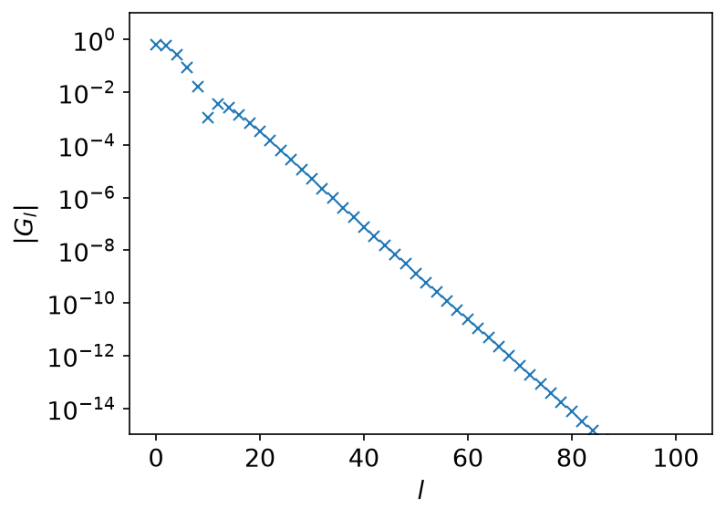
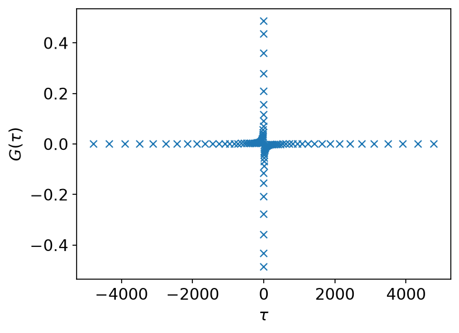
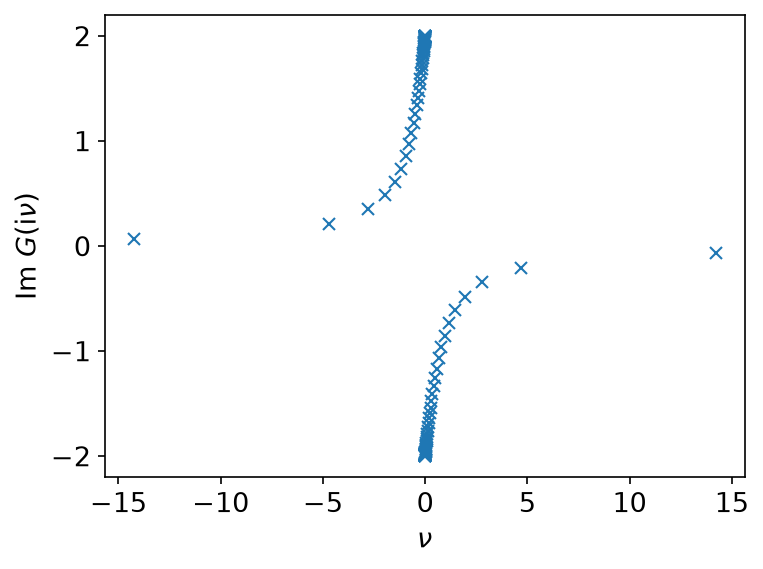
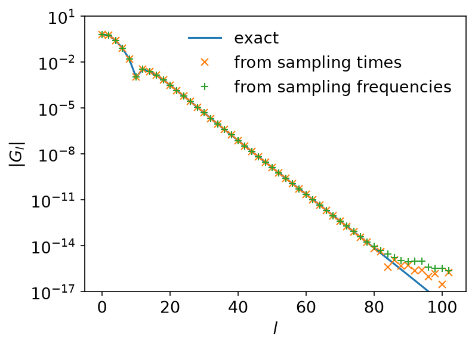
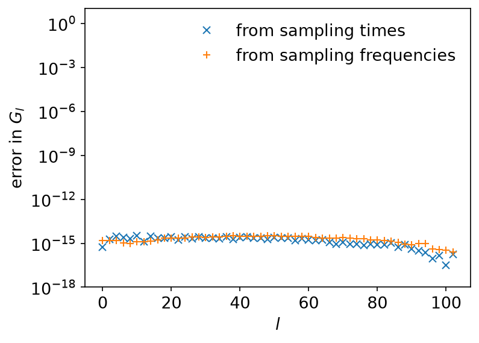

# Sparse sampling

*Ported from the Python notebook `sparse_sampling_demo_py.ipynb` of
sparse-ir-tutorial. The program that produced every number and figure on this
page is `docs/tutorial-code/src/bin/sparse_sampling_demo.rs`.*

This page shows how to infer the IR expansion coefficients of a Green's
function from its values at a handful of points — the *sparse sampling*
technique that makes the basis useful in practice. You never need `G` on a
dense grid; you need it at as many points as the basis has functions.

## Setup

Take the semicircular spectral function of full bandwidth 2,

\\[
    \rho(\omega) = \frac{2}{\pi}\sqrt{1-\omega^2},
\\]

at \\(\beta = 10^4\\) and \\(\omega_\mathrm{max} = 1\\). Asking for
\\(\varepsilon = 10^{-15}\\) gives a basis of 104 functions.

```rust
use sparse_ir::{Fermionic, FiniteTempBasis, LogisticKernel};

let beta = 10_000.0;
let wmax = 1.0;
let kernel = LogisticKernel::new(beta * wmax)?;
let basis = FiniteTempBasis::<LogisticKernel, Fermionic>::new(kernel, beta, Some(1e-15), None)?;

assert_eq!(basis.size(), 104);
# Ok::<(), sparse_ir::Error>(())
```

The exact coefficients are \\(G_l = -s_l \rho_l\\) with
\\(\rho_l = \int \mathrm{d}\omega\, v_l(\omega) \rho(\omega)\\). They fall off
exponentially, which is the whole reason the basis is small:



Only even \\(l\\) is shown: \\(\rho\\) is even in \\(\omega\\), so every odd
coefficient vanishes.

## From the sampling times

`TauSampling` picks the default sampling times — the roots of the first basis
function the truncation discarded — and builds the matrix
\\(A_{il} = u_l(\tau_i)\\) that turns coefficients into values.

```rust,ignore
use sparse_ir::TauSampling;

let sampling = TauSampling::<Fermionic>::new(&basis)?;
println!("{} sampling times", sampling.sampling_points().len());
println!("condition number: {}", sampling.condition_number()?);
```

There are 104 of them, as many as the basis has functions, and the condition
number is about 51.8 — so a fit from the sampling times loses one or two
significant digits, no more.

The times come back on \\([-\beta/2, \beta/2]\\) rather than on
\\([0, \beta)\\); see [Conventions](../getting-started/conventions.md) for why.

```rust,ignore
let g_tau = sampling.evaluate(&g_l)?;      // coefficients → values
let g_l_again = sampling.fit(&g_tau)?;     // values → coefficients
```



## From the sampling frequencies

`MatsubaraSampling` does the same in frequency. Its points are integers — the
index \\(n\\) of \\(\mathrm{i}\nu_n = \mathrm{i}(2n+1)\pi/\beta\\) — and `G` is
complex there, so the coefficients go in and come back as `Complex64`.

```rust,ignore
use num_complex::Complex64;
use sparse_ir::MatsubaraSampling;

let sampling = MatsubaraSampling::<Fermionic>::new(&basis)?;
let g_l_complex: Vec<Complex64> = g_l.iter().map(|&g| Complex64::new(g, 0.0)).collect();
let g_iv = sampling.evaluate(&g_l_complex)?;
let g_l_again = sampling.fit(&g_iv)?;
```

The condition number is about 213, roughly four times that of the sampling
times — the price of working in frequency.



Because \\(\rho\\) is even in \\(\omega\\), \\(G(\mathrm{i}\nu)\\) is purely
imaginary; the real part that comes back is rounding error, about
\\(10^{-15}\\) of the imaginary part.

## Comparison with the exact result

Both fits recover the exact coefficients:



The curves lie on top of each other until the coefficients themselves drop
below \\(10^{-14}\\), where there is nothing left to recover. The differences
say the same thing more directly:



The error sits at \\(10^{-16}\\)–\\(10^{-15}\\) — the accuracy of the basis
times the condition number of the fit, which is exactly what the two condition
numbers above predicted.

## Key API pieces

| What you want | What to call |
| --- | --- |
| the sampling points | `TauSampling::sampling_points`, `MatsubaraSampling::sampling_points` |
| how much a fit costs you | `condition_number` |
| coefficients → values | `evaluate` |
| values → coefficients | `fit` |
| your own points instead of the defaults | `TauSampling::with_sampling_points` |

`evaluate` and `fit` have `_to` variants that write into a slice you own, and
`_nd` variants for a whole array of Green's functions sharing one basis — use
those in an inner loop, where allocating per call would dominate.
