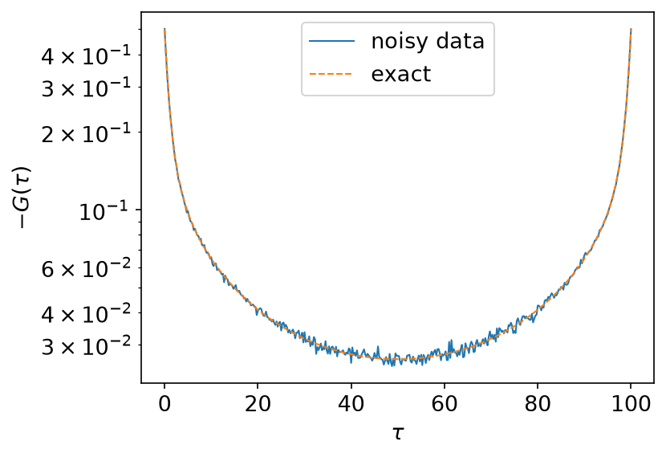
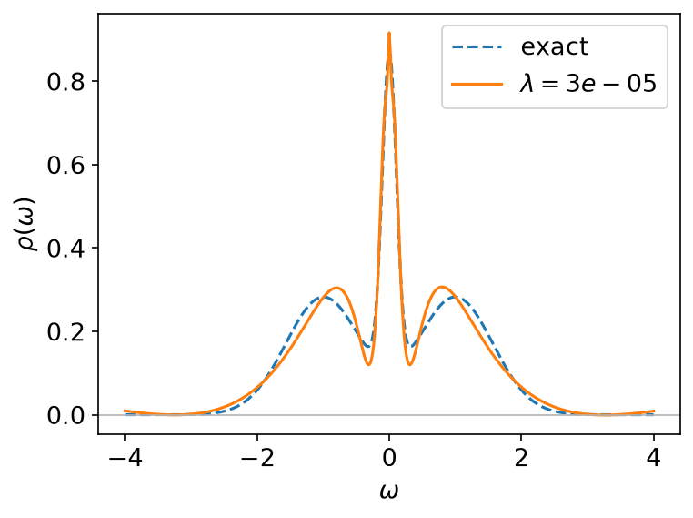
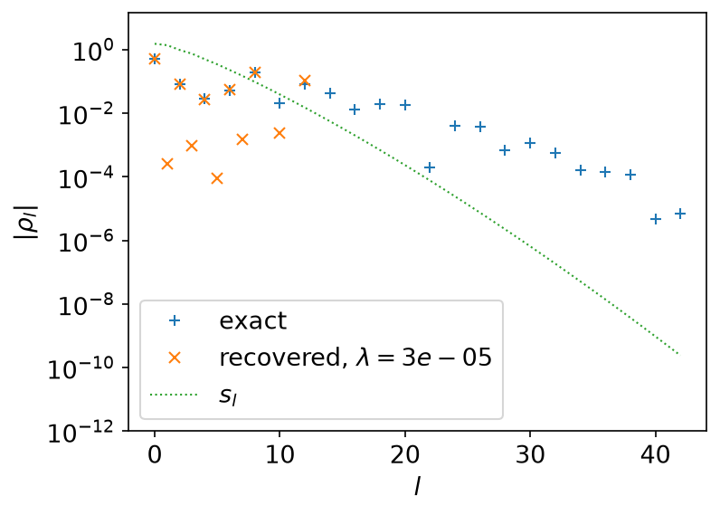
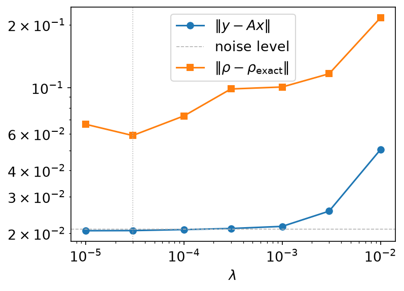
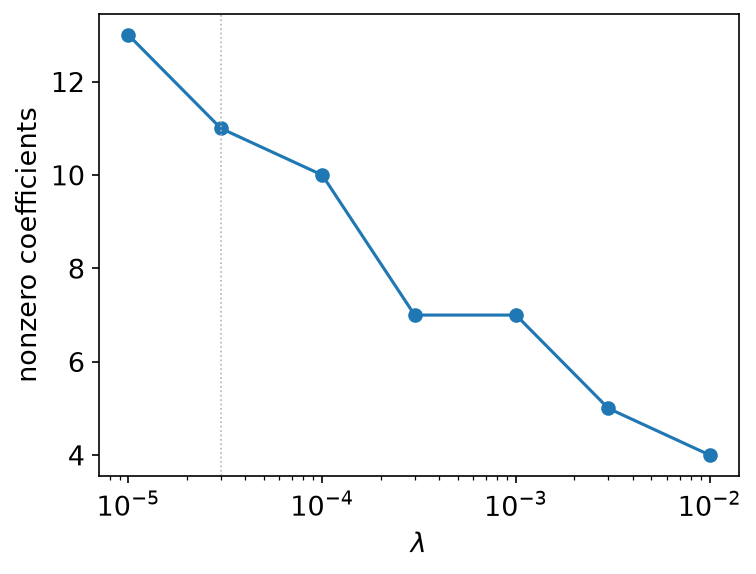

# Sparse modeling

*Ported from the Python notebook
[`spm_py.ipynb`](https://spm-lab.github.io/sparse-ir-tutorial-v2/src/spm_py.html)
of [sparse-ir-tutorial-v2](https://spm-lab.github.io/sparse-ir-tutorial-v2/).
The program that produced every number and figure on this page is
`docs/tutorial-code/src/bin/spm.rs`; the code below is included from it.*

This page solves one analytic-continuation problem end to end: from a noisy
\\(G(\tau)\\) back to the \\(\rho(\omega)\\) that produced it, with an L1
penalty on the IR coefficients. The problem is ill posed: the kernel smooths,
so the inverse sharpens, and it sharpens the noise along with the signal.
[Analytic continuation](analytic_continuation.md) looks at that difficulty
itself and at two simpler regularisers.

The IR basis makes the difficulty explicit rather than making it go away. In
the basis,

\\[
    G_l = -s_l \rho_l,
\\]

so recovering \\(\rho_l\\) means dividing by \\(s_l\\). The singular values
fall off exponentially, so past the point where \\(s_l\\) drops below the noise
level, the data say nothing at all about \\(\rho_l\\). *Sparse modeling* is the
choice to set those coefficients to zero rather than to let them be whatever
the noise dictates.

## The problem

Minimise, over the IR coefficients \\(x_l = \rho_l\\),

\\[
    \tfrac12 \lVert y - A x \rVert^2 + \lambda \lVert x \rVert_1,
    \qquad y_i = -G(\tau_i), \quad A_{il} = u_l(\tau_i)\, s_l .
\\]

The first term says the answer must explain the data. The L1 penalty is what
makes the solution *sparse*: unlike a least-squares penalty, it drives
coefficients to exactly zero instead of merely making them small. \\(\lambda\\)
decides how many survive.

## The data

The notebook downloads a sample `Gtau.in` from the SpM repository. This port
ships its input instead, `docs/tutorial-code/input/spm/gtau.csv`. It is
\\(G(\tau)\\) of the three-Gaussian spectral function from
[the transformation page](transformation.md), at \\(\beta = 100\\) and
\\(\omega_\mathrm{max} = 4\\), on 401 uniform times \\(\tau_i \in [0, \beta]\\),
plus independent Gaussian noise of size \\(10^{-3}\\). Unlike the downloaded
file, it comes with the exact answer.



The noise is invisible here — \\(10^{-3}\\) against a curve of order 1 — and it
is what decides how much of the spectrum can be recovered.

```rust,ignore
{{#include ../../../tutorial-code/src/bin/spm.rs:input}}
```

## Building `A`

The basis has \\(\varepsilon = 10^{-10}\\) and 43 functions:

```rust
{{#include ../../../tutorial-code/src/bin/spm.rs:imports}}
{{#include ../../../tutorial-code/src/bin/spm.rs:parameters}}
{{#include ../../../tutorial-code/src/bin/spm.rs:basis}}
# Ok::<(), Box<dyn std::error::Error>>(())
```

\\(A\\) is the matrix of basis functions at the sampled times, scaled by the
singular values. `evaluate_tau` returns \\(u_l(\tau_i)\\) with the points along
the first axis:

```rust,ignore
{{#include ../../../tutorial-code/src/bin/spm.rs:design_matrix}}
```

43 unknowns against 401 equations — and still ill posed, because the last
columns of \\(A\\) are multiplied by singular values of order \\(10^{-10}\\).

## Solving it

`sparse_ir_tutorial::fista` is the standard proximal-gradient method: a
gradient step on the smooth part, then the proximal operator of the penalty,
with Nesterov momentum in between. For an L1 penalty the proximal operator is
soft thresholding — shrink every coefficient towards zero by a fixed amount and
clip the ones that would cross.

```rust,ignore
{{#include ../../../tutorial-code/src/bin/spm.rs:solve}}
```

The step length is \\(1/L\\), with \\(L\\) the largest eigenvalue of
\\(A^\mathsf{T} A\\), computed by power iteration. The iteration runs for a
fixed budget of 20 000 steps rather than stopping on a tolerance: FISTA's
momentum makes the step-to-step change oscillate rather than fall
monotonically, so a small tolerance is either never reached or reached at an
unpredictable step. The program checks that every solution has settled to a
relative change below \\(10^{-6}\\) by the end of the budget.

## What comes out



All three peaks come back, the narrow central one included, from data whose
noise is a thousand times smaller than the signal but ten million times larger
than the smallest singular value that matters.



This is the mechanism, in one picture. Only 11 of the 43 coefficients are
nonzero; the rest are *exactly* zero, not small. The cut-off sits where
\\(s_l\\) falls to about \\(10^{-3}\\) — the noise level. Below that the data
carry no information about \\(\rho_l\\), and the L1 penalty declines to invent
any.

## Choosing λ



The residual sits flat at the noise level, \\(\lVert \delta G \rVert \approx
10^{-3}\sqrt{401} \approx 0.021\\), until \\(\lambda \approx 10^{-3}\\), and
then rises: past that point the penalty is discarding signal, not noise. The
error against the exact spectrum bottoms out earlier, at
\\(\lambda = 3\times10^{-5}\\), which is the value this page reports.

The two do not coincide, and that is the honest situation: the error curve
needs the answer you are trying to find. In practice you have only the residual
curve and the noise level, which together bracket \\(\lambda\\) to about a
decade — and within that decade the spectrum barely changes.



## What this port leaves out

The notebook solves a *constrained* version of the same problem: it adds
\\(\rho(\omega) \ge 0\\) and the sum rule \\(\int\mathrm{d}\omega\,\rho = 1\\)
as hard constraints. Neither has a cheap proximal operator — \\(\rho \ge 0\\)
is a constraint on \\(V x\\), not on \\(x\\) — so the notebook reaches for ADMM
and the `admmsolver` package. This port keeps the solver to twenty lines of
FISTA and drops both constraints.

The output says what that costs. The recovered spectrum dips to
\\(-7\times10^{-4}\\) — visible in the figure as the curve crossing zero
between the peaks — and the sum rule comes out at 1.0029 rather than exactly 1.
Both are small because the L1 fit is already close to the truth, not because
anything enforced them. If you need a spectrum that is non-negative by
construction, you need the constrained solver.

## Running it

From `docs/tutorial-code`:

```console
$ cargo run --release --bin spm
```

The program writes CSV tables to `docs/tutorial-code/data/spm/`. The figures
are drawn from those tables; from the repository root, run
`uv run --project docs/plotting python docs/plotting/spm_plot.py`. The input
was written once by `docs/tutorial-code/scripts/make_spm_input.py` from a fixed
seed, so this program and its Python counterpart,
`docs/tutorial-code/scripts/reference_spm.py`, start from the same numbers.
Because the power iteration has a fixed number of steps from a fixed start
and FISTA a fixed budget, the two also follow the same trajectory and agree
to about \\(10^{-14}\\), far closer than the \\(10^{-6}\\) the iteration itself
is settled to.

## Key API pieces

From `sparse-ir`:

| What you want | What to call |
| --- | --- |
| \\(u_l(\tau_i)\\) for arbitrary times | `Basis::evaluate_tau` |
| \\(v_l(\omega_j)\\) for arbitrary frequencies | `Basis::evaluate_omega` |
| the singular values | `FiniteTempBasis::s` |

From the tutorial crate (`sparse_ir_tutorial`, not part of the library):

| What you want | What to call |
| --- | --- |
| the solver | `fista`, `soft_threshold` |
| the committed input | `read_table`, `input_path` |

`sparse-ir` gives you the basis and the transforms; the solver is up to you.
