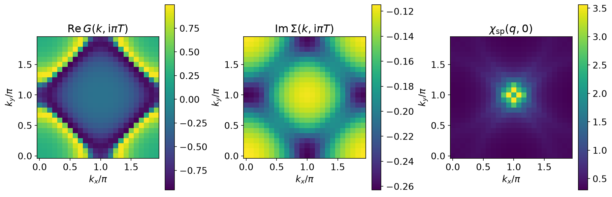
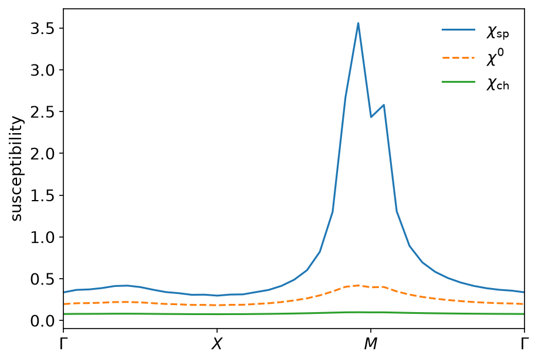
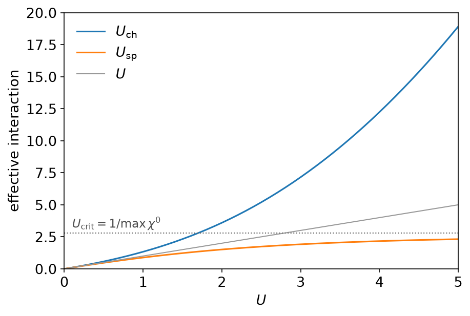
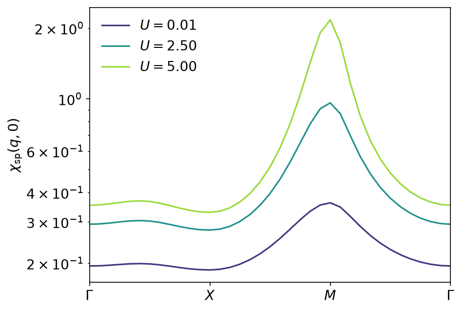

# Two-particle self-consistency

*Ported from the Python notebook `TPSC_py.ipynb` of sparse-ir-tutorial, whose
author is Niklas Witt. The programs that produced every number and figure on
this page are `docs/tutorial-code/src/bin/tpsc.rs` and
`docs/tutorial-code/src/bin/tpsc_scan.rs`.*

The previous page iterated a self-consistency loop thousands of times. This
one does not iterate at all: the two-particle self-consistent approach fixes
its vertices by solving two scalar equations, and the whole calculation is a
single pass through the basis with a pair of root searches in the middle.

## Vertices from sum rules

TPSC starts where RPA starts, with the irreducible susceptibility of the
square lattice at half bandwidth \\(4t\\),

\\[
\chi^0(\mathrm{i}\nu^B, q) \;=\; -\frac{1}{N_k}\sum_{k}
\int_0^\beta \mathrm{d}\tau\;
\mathrm{e}^{\mathrm{i}\nu^B\tau}\, G(\tau, k)\, G(-\tau, k - q),
\\]

and dresses it in the usual geometric way,

\\[
\chi_\mathrm{sp} = \frac{\chi^0}{1 - U_\mathrm{sp}\chi^0},
\qquad
\chi_\mathrm{ch} = \frac{\chi^0}{1 + U_\mathrm{ch}\chi^0}.
\\]

What is different is where \\(U_\mathrm{sp}\\) and \\(U_\mathrm{ch}\\) come
from. RPA sets both to the bare \\(U\\) and is done. TPSC instead demands that
the two susceptibilities satisfy the local sum rules exactly,

\\[
\frac{2}{N_k\beta}\sum_{q,m} \chi_\mathrm{sp}(\mathrm{i}\nu^B_m, q)
 = n - 2\langle n_\uparrow n_\downarrow\rangle,
\qquad
\frac{2}{N_k\beta}\sum_{q,m} \chi_\mathrm{ch}(\mathrm{i}\nu^B_m, q)
 = n + 2\langle n_\uparrow n_\downarrow\rangle - n^2,
\\]

and closes the first of them with the Kanamori–Brueckner ansatz
\\(\langle n_\uparrow n_\downarrow\rangle = \tfrac14 (U_\mathrm{sp}/U)\,n^2\\).
That makes the spin rule an equation in \\(U_\mathrm{sp}\\) alone; the double
occupancy that comes out of it then makes the charge rule an equation in
\\(U_\mathrm{ch}\\) alone. Two one-dimensional root searches, no loop.

The sums on the left are the reason this page belongs in a basis tutorial. A
sum over every bosonic Matsubara frequency is, in the basis, the value of the
zone-averaged susceptibility at \\(\tau = 0\\): fit once, evaluate once.

```rust,ignore
let chi = rpa(chi_0, vertex);
let averaged: Vec<Complex64> = (0..mesh_b.n_wn())
    .map(|i| chi[i * nk..(i + 1) * nk].iter().sum::<Complex64>() / nk as f64)
    .collect();
let coefficients = mesh_b.wn_to_l(&averaged, 1)?;
Ok(evaluate_rows(&ub_at_zero, &coefficients, 1)[0].re)
```

Each evaluation of the sum rule costs one fit of 31 sampling points onto 30
basis functions and one evaluation of \\(U^B_\ell(0)\\), so putting it inside
a bisection is affordable. With a truncated Matsubara sum it would not be:
the tail of \\(\chi\\) decays as \\(1/\nu^2\\) and the sum rule is precisely
the quantity that tail controls. This is also why `roots.rs` — Brent's method
and a plain bisection — is back in the tutorial crate; every earlier page
needed only forward evaluation.

\\(\chi^0\\) itself is the same convolution as on the GW page, built as a
product in \\((\tau, r)\\):

```rust,ignore
let gkt = mesh_f.wn_to_tau(gkio, nk)?;
let grt = grid.k_to_r(&gkt);
let reversed = mesh_f.reverse_tau(&grt, nk);
let product: Vec<Complex64> = grt.iter().zip(&reversed).map(|(a, b)| a * b).collect();
mesh_b.tau_to_wn(&grid.r_to_k(&product), nk)
```

The one subtlety is `reverse_tau`, which produces \\(G(-\tau)\\) by reading
the sampling points backwards. That is legitimate only because the fermionic
and bosonic \\(\tau\\) grids of a shared kernel are the same grid and are
symmetric about \\(\beta/2\\); `Lattice::new` asserts both facts rather than
trusting them. It is also what lets the product, sampled on fermionic times,
be fitted with the bosonic sampling object.

## One solve at U = 4

`tpsc` takes a \\(24 \times 24\\) lattice at \\(\beta = 10\\), filling
\\(n = 0.85\\), \\(U = 4\\) and \\(\varepsilon = 10^{-10}\\). The basis has 30
functions for each statistics, giving 30 \\(\tau\\) points, 30 fermionic and
31 bosonic frequencies — the entire frequency content of a lattice problem at
\\(\beta\omega_\mathrm{max} = 100\\).

The vertices come out as

\\[
U_\mathrm{sp} = 2.1011 \;<\; U = 4 \;<\; U_\mathrm{ch} = 7.6738,
\\]

which is the qualitative statement TPSC exists to make: spin fluctuations
screen the interaction in the spin channel and anti-screen it in the charge
channel, and RPA's \\(U_\mathrm{sp} = U\\) overshoots badly. The double
occupancy is \\(0.0949\\), well below the uncorrelated \\((n/2)^2 = 0.1806\\).

Note also \\(U_\mathrm{crit} = 1/\max\chi^0 = 2.3821\\). The spin sum rule has
no solution above it — the RPA denominator would change sign — so
\\(U_\mathrm{sp}\\) is bounded by \\(U_\mathrm{crit}\\) no matter how large
\\(U\\) grows. That bound is what enforces the Mermin–Wagner theorem here, and
a request that would violate it is reported as `TpscError::Ordered` rather
than producing a number.



The zeroth Matsubara slice shows a Fermi surface in \\(\mathrm{Re}\,G\\),
\\(|\mathrm{Im}\,\Sigma|\\) largest near the antinodes \\((\pi, 0)\\) — the
beginning of the pseudogap — and \\(\chi_\mathrm{sp}\\) piled up around
\\(M = (\pi,\pi)\\).



Along the high-symmetry path the ordering \\(\chi_\mathrm{sp} > \chi^0 >
\chi_\mathrm{ch}\\) holds everywhere, and the enhancement is strongly
momentum-selective: a factor of about 8.5 at the peak against 1.7 at
\\(\Gamma\\). The peak is not at \\(M\\). At \\(n = 0.85\\) the system is
doped, nesting is incommensurate, and the maximum sits one grid step away at
\\((\pi, 11\pi/12)\\) with the value \\(3.559\\) against \\(2.434\\) at
\\(M\\) itself. The verification test asserts the peak lies on
\\(k_x = \pi\\) within one grid step of \\(M\\), not at \\(M\\).

## Scanning U

`tpsc_scan` repeats the solve at half filling and \\(T = 0.4\\) for 51 values
of \\(U\\) from \\(0.01\\) to \\(5\\), which is the sweep behind Fig. 2 of
Vilk and Tremblay (1997).



\\(U_\mathrm{crit} = 2.7789\\) is a property of \\(\chi^0\\) and so is the
same at every point of the scan — the test checks that it is literally
constant. \\(U_\mathrm{sp}\\) rises from \\(0.00999\\) and flattens against
that ceiling, reaching \\(2.318\\), i.e. \\(83\%\\) of \\(U_\mathrm{crit}\\),
at \\(U = 5\\). \\(U_\mathrm{ch}\\) has no such bound and runs away to
\\(18.9\\). Between them the double occupancy falls from \\(0.2497\\) — the
uncorrelated \\(1/4\\) — to \\(0.1159\\).



The susceptibility at half filling does peak at \\(M\\), and it grows by a
factor of six there between \\(U = 0.01\\) and \\(U = 5\\) while barely
doubling at \\(\Gamma\\). The saturating \\(U_\mathrm{sp}\\) is what keeps
that growth finite: in RPA the same sweep would have diverged long before
\\(U = 5\\).

## Running it

Both programs are fast. `tpsc` is a single solve of a \\(24\times24\\)
lattice; `tpsc_scan` is 51 of them at a smaller basis and finishes in a
fraction of a second, so despite the name it is registered as an ordinary
example rather than gated behind `SPARSEIR_TUTORIAL_SCANS`:

```console
$ SPARSEIR_TUTORIAL_RUN=1 cargo test --release \
      --test tutorial_binaries --test verification
```

or `scripts/check.sh --run --release`.

## Key API pieces

| What you want | What to call |
| --- | --- |
| a Matsubara sum over all frequencies | `IrMesh::wn_to_l`, then evaluate \\(U_\ell(0)\\) with `evaluate_rows` |
| \\(G(-\tau)\\) on the sampling grid | `IrMesh::reverse_tau` |
| a fermionic product fitted as bosonic | `IrMesh::wn_to_tau` on one mesh, `IrMesh::tau_to_wn` on the other |
| one SVE for both statistics | `compute_sve`, then `FiniteTempBasis::from_sve_result` twice |
| \\(\chi^0\\) as a real-space product | `MomentumGrid::k_to_r`, `MomentumGrid::r_to_k` |
| solving a sum rule for a vertex | `brent` from `tutorial::roots` |
