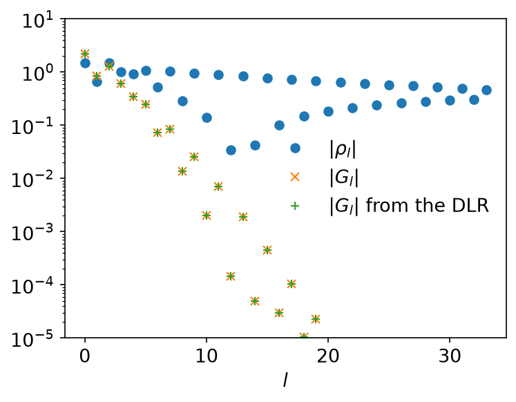
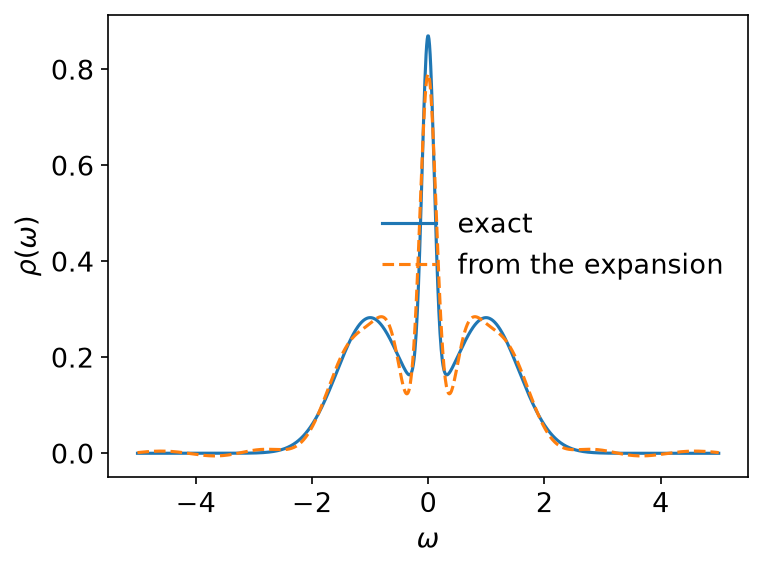
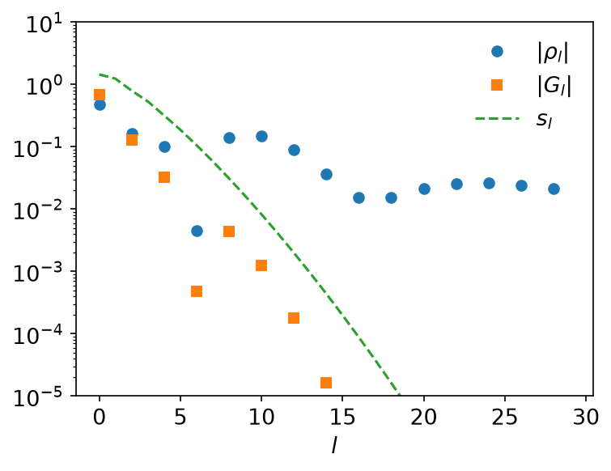
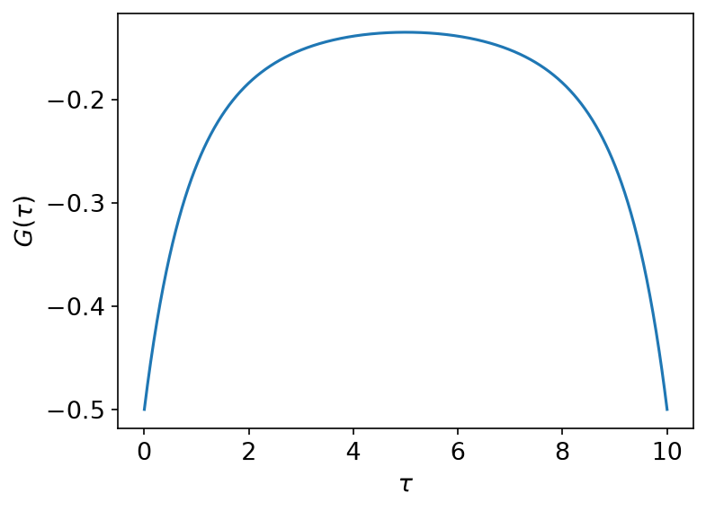
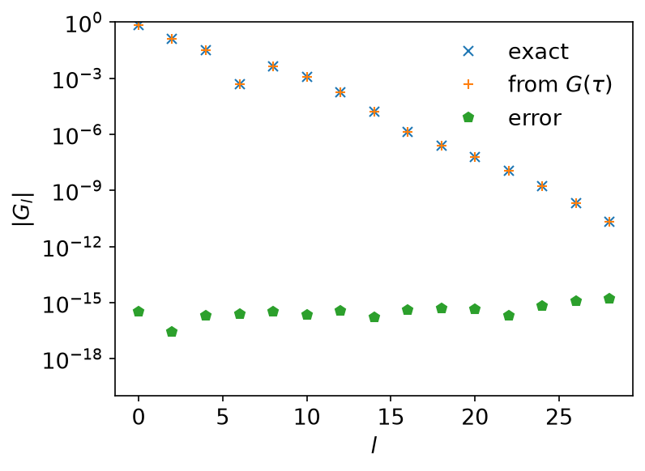
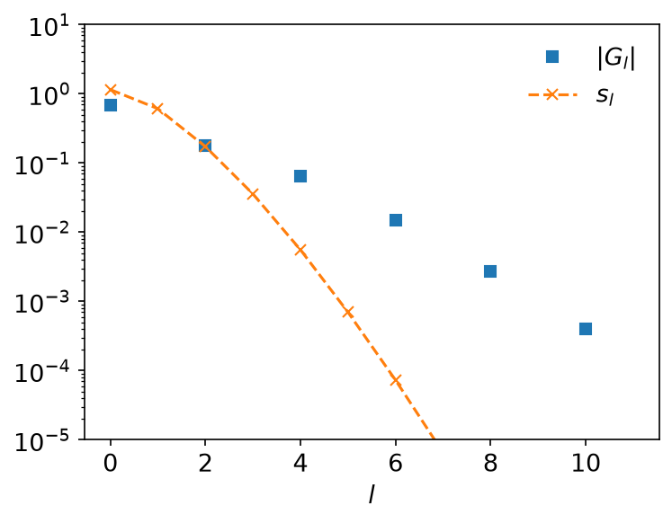

# Transformation from and to IR

*Ported from the Python notebook `transformation_py.ipynb` of
sparse-ir-tutorial. The program that produced every number and figure on this
page is `docs/tutorial-code/src/bin/transformation.rs`.*

The basis is only useful once your data is in it. This page covers the three
ways data usually arrives — as poles, as a smooth spectral function, as
`G(τ)` on a grid — and the way back out.

## Poles

A Green's function made of poles,

\\[
    G(\mathrm{i}\nu) = \sum_{p} \frac{a_p}{\mathrm{i}\nu - \bar\omega_p},
    \qquad
    A(\omega) = \sum_p a_p \delta(\omega - \bar\omega_p),
\\]

needs no quadrature at all. The logistic kernel expands the *regularized*
spectral function, which for bosons carries an extra factor,

\\[
    \rho(\omega) = \sum_p c_p \delta(\omega - \bar\omega_p),
    \qquad
    c_p = \begin{cases} a_p & \text{(fermions)},\\
                        a_p / \tanh(\beta\bar\omega_p/2) & \text{(bosons)},\end{cases}
\\]

so the overlap integral collapses to \\(\rho_l = \sum_p c_p v_l(\bar\omega_p)\\).

```rust
use sparse_ir::{Basis, Bosonic, FiniteTempBasis, LogisticKernel};

let (beta, wmax) = (15.0, 10.0);
let kernel = LogisticKernel::new(beta * wmax)?;
let basis = FiniteTempBasis::<LogisticKernel, Bosonic>::new(kernel, beta, Some(1e-10), None)?;

let pole = 0.1;
let weight = 1.0 / (0.5 * beta * pole).tanh();

// evaluate_omega gives a [points, size] matrix of v_l(ω).
let v_at_pole = basis.evaluate_omega(&[pole])?;
let g_l: Vec<f64> = (0..basis.size())
    .map(|l| -basis.s()[l] * v_at_pole.get(&[0, l]).unwrap() * weight)
    .collect();

assert_eq!(g_l.len(), 34);
# Ok::<(), sparse_ir::Error>(())
```

The `DiscreteLehmannRepresentation` says the same thing in one call: give it
the poles and it turns pole weights into IR coefficients.

```rust,ignore
use sparse_ir::{DlrFromIr, TypedTensor};

let dlr = DiscreteLehmannRepresentation::<Bosonic>::from_ir_with_poles(&basis, vec![pole])?;
let weights = TypedTensor::from_vec_col_major(vec![1], vec![weight])?;
let g_l_dlr = dlr.to_ir_nd::<f64>(None, &weights, 0)?;
```

Both routes give the same coefficients to the last bit:



## From a smooth spectral function

For a smooth \\(\rho\\) the coefficients are an integral,

\\[
    \rho_l = \int_{-\omega_\mathrm{max}}^{\omega_\mathrm{max}}
             \mathrm{d}\omega\, v_l(\omega)\, \rho(\omega).
\\]

A single Gauss-Legendre rule over the whole interval will not do. The roots of
\\(v_l\\) crowd together near \\(\omega = 0\\) — far more densely than the
roots of a Legendre polynomial of the same degree — so the integrand varies on
a scale the rule cannot see. Split the interval at the knots the basis
functions are built on, where each \\(v_l\\) is a polynomial, and apply the
rule on every piece; if \\(\rho\\) is smooth within a piece, the result
converges exponentially in the order.

`PiecewiseLegendrePolyVector::get_knots` hands you exactly those division
points, and `sparse_ir::legendre` the rule to put on them:

```rust,ignore
let v = basis.v();
let edges = v.get_knots(None);
let order = v.get_polyorder() + 8;
let rho_l: Vec<f64> = (0..basis.size())
    .map(|l| integrate_segments(|w| v[l].evaluate(w) * rho(w), &edges, order))
    .collect();
let g_l: Vec<f64> = basis.s().iter().zip(&rho_l).map(|(s, r)| -s * r).collect();
```

The spectral function here is three Gaussian peaks, one of them narrow:



The dashed line is \\(\sum_l v_l(\omega) \rho_l\\), evaluated on a grid the
basis never saw — the expansion is good everywhere, not only at the knots.



\\(G_l\\) falls off like \\(s_l\\); \\(\rho_l\\) does not, because the narrow
peak needs high \\(l\\) to resolve. That is the normal picture, and the next
section shows what the abnormal one looks like.

## From IR to imaginary time

With \\(G_l\\) in hand, \\(G(\tau) = \sum_l u_l(\tau) G_l\\) on any grid you
like. Either evaluate the basis functions,

```rust,ignore
let u_at_taus = basis.evaluate_tau(&taus)?;   // [taus.len(), size]
```

or hand the same points to `TauSampling`, which builds that matrix once and
can also go back the other way:

```rust,ignore
let sampling = TauSampling::<Fermionic>::with_sampling_points(&basis, taus)?;
let g_tau = sampling.evaluate(&g_l)?;
```

Nothing requires these to be the *default* sampling points. They are an
arbitrary dense grid here, which is what you want for a figure:



## From full imaginary-time data

Going back from \\(G(\tau)\\) known everywhere, the stable route is the
overlap integral

\\[
    G_l = \int_0^\beta \mathrm{d}\tau\, G(\tau)\, u_l(\tau),
\\]

by the same composite quadrature as before, now on the knots of `basis.u()`.
It recovers the coefficients to the accuracy of the basis:



Only even \\(l\\) is shown — \\(\rho\\) is even in \\(\omega\\), so the odd
coefficients vanish.

## What if ωmax is too small?

Expand the very same \\(G(\tau)\\) in a basis built for
\\(\omega_\mathrm{max} = 0.5\\), far too narrow for a spectral function that
reaches out to \\(\omega \approx 3\\):



The coefficients stop following the singular values down. That is the signal,
and the only one you get: nothing errors, the expansion simply does not
converge. If \\(G_l\\) does not decay like \\(s_l\\), widen
\\(\omega_\mathrm{max}\\).

## Many Green's functions at once

`evaluate` and `fit` have `_nd` variants that transform one axis of an array,
which is what you want when many Green's functions share a basis — orbital
indices, momenta, a self-energy on a grid.

```rust,ignore
let sampling = MatsubaraSampling::<Fermionic>::new(&basis)?;
// coeffs has shape [2, 3, basis.size()]; transform along axis 2.
let values = sampling.evaluate_nd_real(None, &coeffs, 2)?;
let recovered = sampling.fit_nd_real(None, &values, 2)?;
```

The `_real` variants take real coefficients and return complex values, which
saves you building a complex copy of an array that has no imaginary part.

## Key API pieces

| What you want | What to call |
| --- | --- |
| \\(v_l\\) or \\(u_l\\) at your own points | `Basis::evaluate_omega`, `Basis::evaluate_tau` |
| the segments to integrate over | `PiecewiseLegendrePolyVector::get_knots` |
| a Gauss-Legendre rule | `sparse_ir::legendre` |
| pole weights → \\(G_l\\) | `DiscreteLehmannRepresentation::to_ir_nd` |
| one axis of an array | the `_nd` and `_nd_real` variants |
